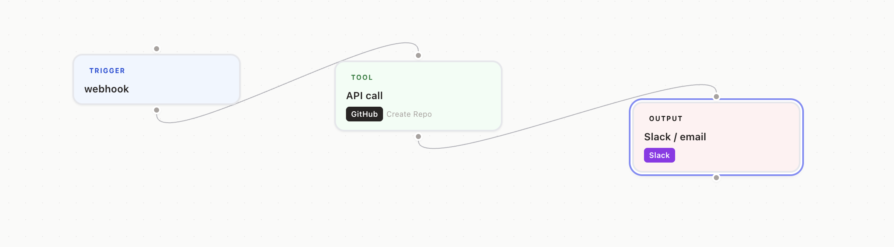
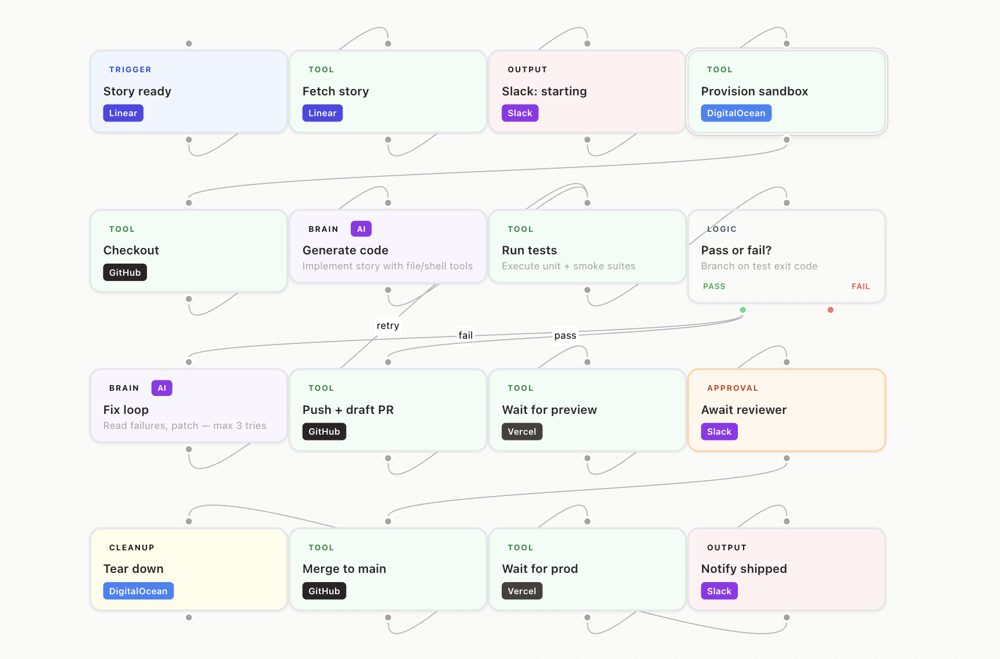

# Delegator

> **Label a GitHub issue `ai-ready`. Delegator clones your repo, writes the fix,
> runs tests on an ephemeral sandbox, and opens a draft PR — then DMs you in
> Slack for one-click approval before anything merges.**

Open-source AI engineer for small teams. Config lives as YAML in your repo
(`<project>-delegator.yml`), runs on your infrastructure, full audit trail,
MIT licensed. Built for teams of 10–80 engineers who want to ship faster
without giving an autonomous agent the keys to production.

**Why this and not Devin / Cursor agents?** Those are autonomous black boxes
optimized for individual developers. Delegator is built for engineering
*teams*: every change goes through a human approval gate, every action is
event-sourced and audit-logged, and the workflow definition lives as a YAML
file in your repo where it can be reviewed in PRs like any other config.

**Why this and not Zapier / n8n?** Those don't have AI agents in the middle.
Delegator's Brain blocks are agentic — Claude reads your codebase, writes
the fix, iterates on test failures, then hands off to a human.





---

## What it does

Delegator lets you build agents on a drag-and-drop canvas (or write the YAML
directly) by wiring together blocks:

| Block | Purpose |
|-------|---------|
| **Trigger** | Starts a run — webhook, schedule, or manual |
| **Brain** | Agentic LLM step (Claude) with tool access and bounded autonomy |
| **Tool** | Deterministic integration call (GitHub, Slack, Linear, Vercel, Railway, etc.) |
| **Logic** | Conditional branch — pass / fail paths |
| **Approval** | Pauses the run, sends a Slack DM with Approve / Reject buttons |
| **Output** | Sends a formatted summary via Slack, Email, or both |
| **Cleanup** | Always runs at the end — tear down sandboxes, close resources |

Each block has a plain-English description field. The compiler turns it into a structured prompt + tool schema. Runs are logged event-by-event and viewable in a live trace UI.

---

## Architecture

```
apps/
  web/      Next.js 14 + React Flow canvas + Tailwind
  api/      FastAPI + SQLAlchemy + Alembic
  api/      worker.py — background run executor (Redis queue)
packages/
  shared/   TypeScript types shared between frontend packages
```

**Infrastructure (local dev via Docker Compose)**

```
postgres   pgvector/pgvector:pg16
redis      redis:7-alpine
api        FastAPI on :8000
worker     Run executor (same image, different entrypoint)
web        Next.js on :3000
```

---

## Getting started

### Prerequisites

- Docker + Docker Compose
- An Anthropic API key

### 1. Clone and configure

```bash
git clone https://github.com/sseshachala/delegator.git
cd delegator
cp .env.example .env
```

Edit `.env` and set at minimum:

```env
ANTHROPIC_API_KEY=sk-ant-...
ENCRYPTION_KEY=<32-char random string>
```

### 2. Start all services

```bash
docker compose up -d
```

### 3. Run database migrations

```bash
docker compose exec api alembic upgrade head
```

### 4. Open the app

- **UI**: http://localhost:3000
- **API docs**: http://localhost:8000/docs

---

## Integrations

Configure credentials in Settings → each integration card expands inline.

| Integration | Actions |
|-------------|---------|
| **GitHub** | create_repo, push_file, create_branch, open_pr, merge_pr, add_repo_secret |
| **Slack** | post_message, send_dm |
| **Linear** | fetch_issue, list_issues, create_issue, create_comment, update_issue_status |
| **Vercel** | list_deployments, get_deployment, wait_for_deployment, get_latest_deployment |
| **Railway** | trigger_deployment, list_services, get_deployment, wait_for_deployment |
| **DigitalOcean** | create_droplet, get_droplet, destroy_droplet, wait_for_droplet |
| **Email** | send_email (Resend or SendGrid) |

---

## Webhooks

Delegator can trigger workflows from external deploy events.

| Endpoint | Service | Events |
|----------|---------|--------|
| `POST /webhooks/vercel` | Vercel | deployment.succeeded, deployment.ready, deployment.failed |
| `POST /webhooks/railway` | Railway | DEPLOY_SUCCESS, DEPLOY_FAILED, DEPLOY_CRASHED |
| `POST /webhooks/slack/interactions` | Slack | Approval button clicks |

To use: create a workflow with a **Trigger** block set to `event_type: webhook`, then paste your public API URL into the respective service's webhook settings.

---

## Running workflows

**Dry Run** — simulates the full execution without making real API calls. Useful for validating block wiring and config.

**Run** — executes immediately against real integrations.

The canvas validates all required fields before either run type starts. Errors are shown as clickable links that jump to the offending block.

---

## Environment variables

| Variable | Required | Description |
|----------|----------|-------------|
| `ANTHROPIC_API_KEY` | Yes | Claude API key |
| `ENCRYPTION_KEY` | Yes | 32-byte key for credential encryption |
| `DATABASE_URL` | Yes | Postgres connection string |
| `REDIS_URL` | Yes | Redis connection string |
| `API_BASE_URL` | Yes | Public URL of the API (for webhook callbacks) |
| `SLACK_SIGNING_SECRET` | Optional | Verifies Slack interactive component payloads |
| `RESEND_API_KEY` | Optional | Resend key for email output |
| `VERCEL_WEBHOOK_SECRET` | Optional | Verifies Vercel webhook signatures |
| `CLERK_SECRET_KEY` | Optional | Enables Clerk authentication |
| `NEXT_PUBLIC_CLERK_PUBLISHABLE_KEY` | Optional | Clerk publishable key for the frontend |

---

## Deployment

### Railway (API + worker)

1. New project → Deploy from GitHub → root directory: `apps/api`
2. Add a **PostgreSQL** plugin
3. Add a second service (same repo, root `apps/api`, start command: `python -m app.worker`)
4. Set environment variables
5. After first deploy: run `alembic upgrade head` via Railway shell

### Vercel (frontend)

1. Connect GitHub repo → root directory: `apps/web`
2. Set `NEXT_PUBLIC_API_URL` to your Railway API URL

---

## License

MIT
