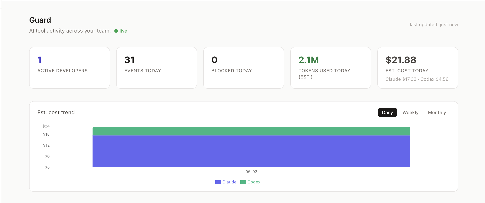
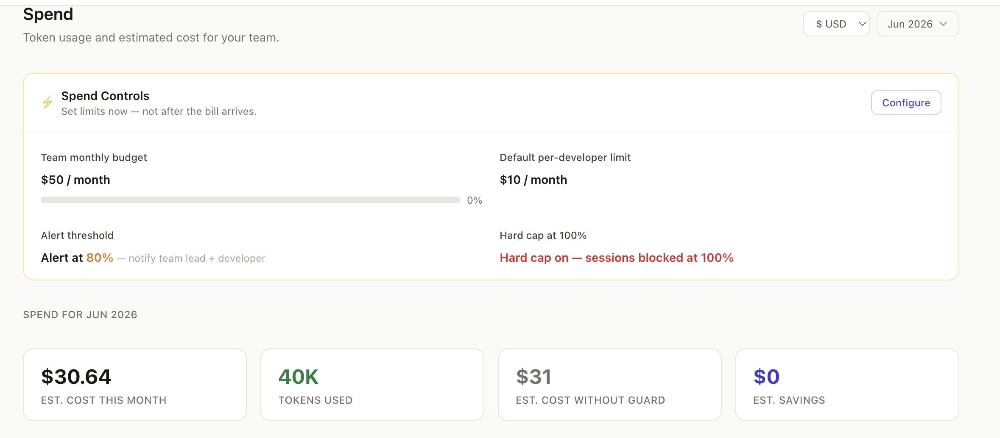
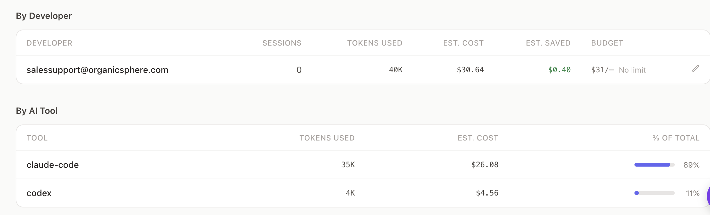
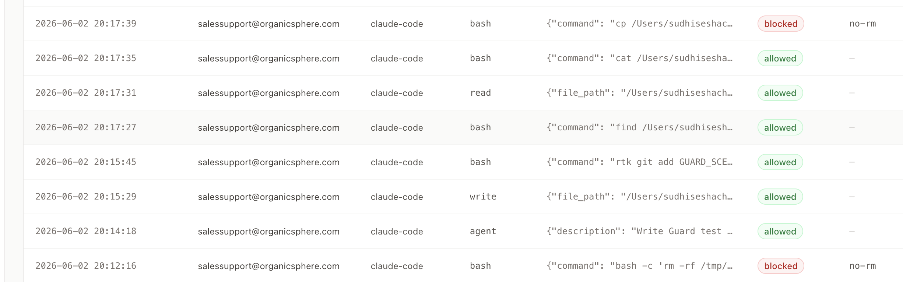
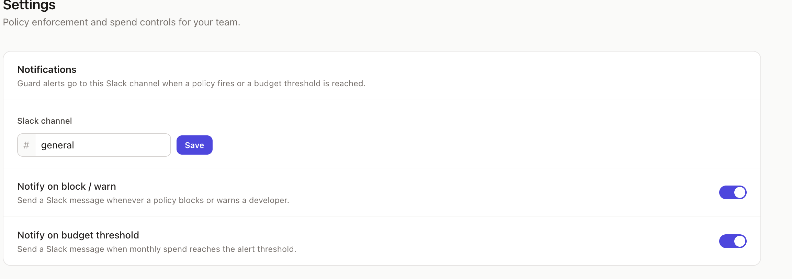
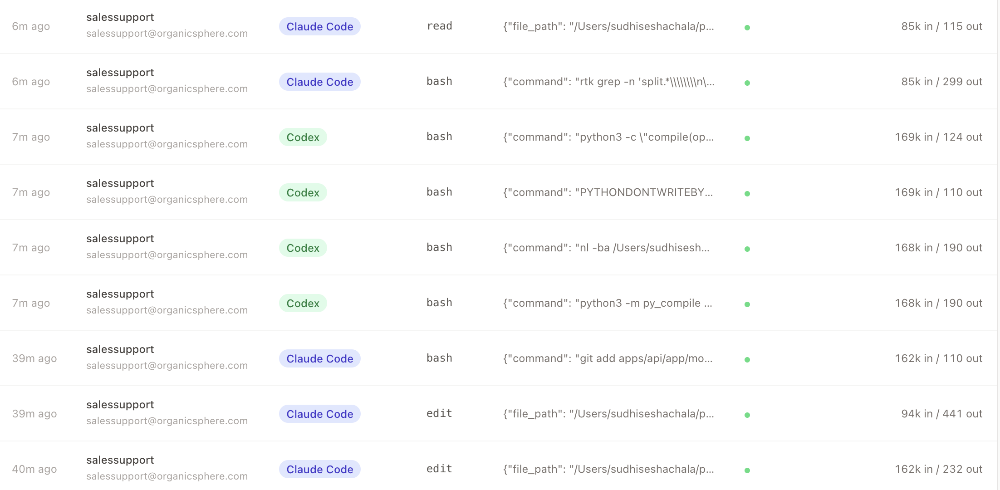

# Conduct

**YAML playbooks that turn AI agents into reusable team automations — with governance, memory, and a full audit trail.**

Label a GitHub issue `ai-ready` → an agent clones your repo, writes the fix, runs tests, and opens a draft PR. One-click Approve or Reject before anything merges. ConductGuard enforces your team's spend limits and policies on every run — and on every Claude Code, Cursor, and Copilot call your developers make locally.

[](LICENSE)
[](https://github.com/sseshachala/conductai/stargazers)
[](https://conductai.ai)

> ⭐ If this saves you time, star it — it helps others find it.

---

## What it does

Conduct runs AI agents on a drag-and-drop canvas (or in YAML). Agents have real tool access — they read code, call APIs, open PRs, post to Slack. You control what they can touch and approve before anything ships.

```
GitHub issue labeled "ai-ready"
  → Memory block recalls what the agent learned on this repo last time
  → Brain block (Claude) reads the issue, clones the repo, writes the fix
  → Guard block checks team policies — spend limit, blocked actions
  → Tool block opens a draft PR
  → Approval block pauses — Slack DM: [Approve] [Reject]
  → Memory block records the outcome for next time
  → Output block posts result to #eng channel
```

Every step is visible. Every run is logged. Nothing merges without a human in the loop.

---

## Why teams pick Conduct

| Problem | Conduct's answer |
|---------|-----------------|
| Autonomous agents are black boxes | Live run trace, three-layer audit log, approval gates on every run |
| No governance over what AI tools spend | ConductGuard: hard cap per developer, blocks the call before it hits the model |
| Agents start from scratch every run | Memory blocks: recall past summaries via vector similarity, record outcomes after |
| Copilot/Cursor PRs need extra scrutiny | AI PR Reviewer playbook with human approval gate before merge |
| One shared credential set across all agents | Per-agent environments — each agent gets its own scoped credentials |
| No visibility into what developers' AI tools are doing | Guard audit log: every Claude Code, Cursor, and Copilot call — decision, rule, cost |
| Hard to move from demo to production | Human-in-the-loop by design — nothing merges without approval |

---

## 18 ready-made playbooks

Install any of these in one click from the [Marketplace](https://conductai.ai/marketplace), configure credentials, and run.

### Issue → PR
| Playbook | Trigger | What it does |
|----------|---------|-------------|
| **Autopilot Quick** | GitHub issue labeled | Implements fix, opens PR immediately |
| **Autopilot Full** | GitHub issue labeled | Implements fix, runs tests with retry, opens PR |
| **Autopilot + Approval** | GitHub issue labeled | Implements fix, runs tests, human approves in Slack, opens PR |

### Code Review
| Playbook | Trigger | What it does |
|----------|---------|-------------|
| **PR Reviewer** | PR opened | Reviews diff for bugs, security, and style; posts a review |
| **Copilot / AI PR Reviewer** | PR opened by Copilot/Cursor/Claude Code | Extra scrutiny for hallucinated APIs and missing tests; human approves before merge |
| **Security Scanner** | PR opened | Scans for OWASP Top 10, hardcoded secrets, auth bypasses; posts report |

### Issue Triage
| Playbook | Trigger | What it does |
|----------|---------|-------------|
| **Issue Triage** | GitHub issue opened | Classifies type and priority, adds labels, posts a clarifying comment if vague |

### CI/CD
| Playbook | Trigger | What it does |
|----------|---------|-------------|
| **CI Failure Alert** | CI build fails | Diagnoses the failed step, posts root cause and suggested fix to Slack |
| **Flaky Test Detective** | Repeated CI failures | Identifies flaky tests, finds the offending commit, posts fix recommendation |

### Release Management
| Playbook | Trigger | What it does |
|----------|---------|-------------|
| **Release Readiness Reviewer** | Release branch cut | Checks open blockers, failed CI, pending reviews; posts go/no-go summary |
| **Release Notes Drafter** | Git tag pushed | Reads merged PRs, groups by type, writes CHANGELOG, posts to Slack |

### Incidents & Ops
| Playbook | Trigger | What it does |
|----------|---------|-------------|
| **Incident Responder** | PagerDuty / OpsGenie webhook | Correlates recent commits and deploys, posts root cause hypothesis to Slack |
| **Postmortem Drafter** | Incident resolved | Reads timeline, alerts, and commits; drafts a structured postmortem |

### Security
| Playbook | Trigger | What it does |
|----------|---------|-------------|
| **Dependency Updater** | Weekly cron | Bumps patch/minor deps, opens a single clean PR |
| **Security Patch Updater** | Dependabot alert | Applies the security patch, runs tests, opens a PR with CVE reference |

### Docs
| Playbook | Trigger | What it does |
|----------|---------|-------------|
| **Docs Drift Detector** | PR merged | Checks if related docs/README/runbooks went stale; opens a docs PR or files an issue |

### Platform & Infra
| Playbook | Trigger | What it does |
|----------|---------|-------------|
| **Terraform Plan Reviewer** | Terraform plan PR opened | Reviews for security misconfigs, cost anomalies, and drift; posts findings |

### Testing
| Playbook | Trigger | What it does |
|----------|---------|-------------|
| **Smoke Test** | Manual / CI | Minimal 1-step pipeline ping for CI gating and worker health checks |

---

## Block types

| Block | What it does |
|-------|-------------|
| **Trigger** | Starts a run — webhook, cron, or manual |
| **Brain** | Agentic Claude step with tool access and bounded autonomy. Auto-routes to Haiku / Sonnet / Opus based on task. |
| **Tool** | Deterministic API call — GitHub, Slack, Linear, Vercel, Railway |
| **Logic** | Branch on pass / fail |
| **Approval** | Pauses the run, sends Slack DM with Approve / Reject |
| **Memory** | Read past summaries before the brain runs; write the outcome after. Powered by vector similarity search. |
| **Guard** | Evaluates active team policies mid-run. Blocks, warns, or audits based on enforcement_mode. Emits a `guard_check` event in the run trace. |
| **Output** | Sends formatted summary via Slack or email |
| **Cleanup** | Always runs last — tear down resources, close loops |

---

## ConductGuard

ConductGuard is MDM for AI coding tools. The security or team lead configures policies and spend limits once — they propagate to every developer's machine within 60 seconds. Developers run Claude Code, Codex, and Cursor exactly as before. Governance just happens.


*Real-time Guard dashboard — active developers, events, blocked calls, token usage, and Claude vs Codex cost breakdown.*

### How control flows

```
Security / Team Lead  →  policies, spend limits, alert thresholds
                               ↓  (synced every 60s)
    Every developer's machine (PreToolUse hook + conductguard-mcp)
                               ↓  (real-time)
Guard dashboard  ←  who, what tool, what decision, tokens, cost
```

### For admins

1. Open **Guard** in the Conduct dashboard
2. Set a **Team monthly budget** and **Hard cap** under Guard → Spend
3. Set **Default per-developer limit** and alert threshold (default 80%)
4. Create policy rules under Guard → Policies (block/warn/audit on tool + pattern)
5. Configure Slack channel under Guard → Settings → Notifications
6. Invite developers via Guard → Team → Invite

### For developers — two commands

```bash
pip install conduct-cli

# Join the team (invite code from your admin)
conduct guard join <invite-code>

# Sync latest policies at any time
conduct guard sync
```

`join` installs the PreToolUse and PostToolUse hooks in `~/.claude/settings.json`, writes `~/.conductguard/config.json`, and pulls current policies. Done.

### Spend controls


*Guard → Spend — set team and per-developer limits. Hard cap blocks all sessions at 100%. Slack alert fires at the configured threshold.*


*By Developer and By AI Tool breakdown — sessions, tokens, cost, savings, and individual budget status.*

When the workspace hard cap or a developer's personal limit is hit, the PreToolUse hook exits with code 2. Claude Code surfaces the message inline before the tool runs:

```
PreToolUse hook error: [ConductGuard] Your team's monthly AI budget of $50.00 has been
reached. New tool calls are paused until the limit is raised. Contact your security team.
```

Spend alerts are deduped — Slack fires once per 5% increment, not on every tool call.

### Policy enforcement


*Guard → Activity — every tool call logged with decision (blocked/allowed), rule ID, developer, and AI tool.*

Rules are created in the dashboard and synced to every developer within 60 seconds:

| Field | Example |
|---|---|
| Match tool | `bash` |
| Match pattern | `rm -rf` |
| Action | `block` |
| Message | `Destructive delete blocked. Use git to revert.` |

When a rule fires, Slack is notified in real time:

```
🚫 dev@yourteam.com blocked by no-rm in claude-code
   Deleting files is not allowed. Use git to revert changes instead.
```

### Slack notifications


*Guard → Settings — configure the alert channel and toggle block/warn and budget threshold notifications independently.*

### Activity log


*Guard → Activity — every Claude Code and Codex session logged: tool call type, input summary, tokens in/out. Realtime.*

### MCP server (Cursor / Windsurf)

```bash
# Auto-registered at conduct guard join. To add manually:
conductguard-mcp
```

Add to `~/.cursor/mcp.json`:

```json
{
  "mcpServers": {
    "conductguard": {
      "command": "conductguard-mcp",
      "args": ["--workspace", "<workspace-id>", "--token", "<member-token>"]
    }
  }
}
```

Three tools exposed to the AI: `guard_status`, `guard_check`, `guard_sync`.

### Guard block in YAML

```yaml
blocks:
  check_policies:
    type: guard
    label: Check team policies
    enforcement_mode: block   # block | warn | audit
    next: deploy_fix
```

### Roles

| Role | Guard access |
|---|---|
| **admin** | Full — policies, budgets, settings, members |
| **security** | Full policy + activity access. Cannot manage members. |
| **developer** | View policies. Own activity and spend only. |
| **viewer** | Own activity only. Read-only. |

---

## Agent Memory

Memory blocks give agents a persistent knowledge store. The agent recalls what it learned last time on this repo before acting — and records the outcome after.

```yaml
blocks:
  recall_context:
    type: memory
    action: read
    scope: repo
    key: "{{_trigger.repo_full_name}}"
    limit: 5
    next: fetch_issue

  record_outcome:
    type: memory
    action: write
    scope: repo
    key: "{{_trigger.repo_full_name}}"
    summary: |
      Issue #{{fetch_issue.issue_number}}: {{fetch_issue.title}}
      Fix: {{implement_fix.approach}}
    next: notify
```

Powered by vector similarity search (OpenAI `text-embedding-3-small`). Falls back to recency-based retrieval if no embedding key is configured — memory still works.

**Two scopes:**
- `repo` — memories isolated per repository (5 repos = 5 independent experts)
- `workspace` — memories shared across all repos in the workspace (team conventions)

---

## Observability — Three audit layers

| Layer | What it covers | Where |
|-------|---------------|-------|
| **Run trace** | Every block state, LLM call, tool call, Guard decision — live SSE stream | `/runs/{id}` |
| **Workspace audit** | Credential changes, agent installs, member events — immutable, append-only | `/audit` |
| **Guard audit** | Every developer AI tool call — decision, rule triggered, tokens, cost, Slack alert | `/guard/audit` |

When a Guard block fires inside a workflow, a `guard_check` run event is emitted inline in the run trace — rules evaluated, verdict, warnings — alongside the other block events. The same event is also written to the Guard audit log. Two lenses on the same moment.

---

## Integrations

| Integration | Actions |
|-------------|---------|
| **GitHub** | clone repo, push file, create branch, open PR, merge PR, add secret |
| **Slack** | post message, send DM, handle approval buttons, Guard policy alerts |
| **Linear** | fetch / create / update issues, add comments |
| **Vercel** | list / get / wait for deployments |
| **Railway** | trigger / monitor deployments |
| **DigitalOcean** | create / destroy droplets |
| **Email** | send via Resend or SendGrid |

---

## Architecture

```
apps/
  web/                  Next.js — canvas UI, run feed, Guard dashboard, settings
  api/                  FastAPI + SQLAlchemy + Alembic
  api/app/runtime/      DAG executor — block dispatch, _emit(), Guard block
  api/app/modules/guard/ Guard team, policies, spend, audit events, MCP auth
  api/worker.py         Background run executor (Redis queue)
packages/
  conduct-cli/          Python CLI — trigger agents, guard join/sync/status
                        conductguard-mcp binary — MCP server for editors
```

---

## Quick start (self-hosted)

### Prerequisites

- Docker + Docker Compose
- Anthropic API key

### 1. Clone and configure

```bash
git clone https://github.com/sseshachala/conductai.git
cd conductai
cp .env.example .env
```

Edit `.env`:

```env
ANTHROPIC_API_KEY=sk-ant-...
ENCRYPTION_KEY=<32-char random string>
```

### 2. Start

```bash
docker compose up -d
docker compose exec api alembic upgrade head
```

### 3. Open

- **UI**: http://localhost:3000
- **API docs**: http://localhost:8000/docs

### 4. Create your first agent

1. **Projects** → New project
2. **Marketplace** → Install a playbook in one click
3. **Settings → Environments** → add GitHub + Slack credentials
4. Assign the environment to your agent on the canvas
5. Hit **Run**

---

## CLI

```bash
pip install conduct-cli

# Authenticate
conduct login \
  --server    https://api.conductai.ai \
  --api-key   cond_live_xxx \
  --workspace <workspace-id>

# Install all playbooks into a project
conduct install-all --project DevOps --repo myorg/my-repo

# Test all agents
conduct test --all --project DevOps

# Guard — join a team and pull policies
conduct guard join <invite-code>
conduct guard status
conduct guard sync
```

---

## Environment variables

| Variable | Required | Description |
|----------|----------|-------------|
| `ANTHROPIC_API_KEY` | Yes | Claude API key |
| `ENCRYPTION_KEY` | Yes | 32-byte key for credential encryption |
| `DATABASE_URL` | Yes | Postgres connection string |
| `REDIS_URL` | Yes | Redis connection string |
| `API_BASE_URL` | Yes | Public API URL (for webhook callbacks) |
| `CLI_API_KEY` | Optional | Shared secret for CLI / CI access |
| `SLACK_SIGNING_SECRET` | Optional | Verifies Slack interactive payloads |
| `RESEND_API_KEY` | Optional | Email output via Resend |
| `SENTRY_DSN` | Optional | Error capture — unhandled exceptions + block failures |
| `CLERK_SECRET_KEY` | Optional | Enables Clerk authentication |
| `NEXT_PUBLIC_CLERK_PUBLISHABLE_KEY` | Optional | Clerk frontend key |
| `OPENAI_API_KEY` | Optional | Enables vector similarity search for Memory blocks |

---

## Deployment

### API + worker (Render)

1. New Web Service → connect GitHub → root directory: `apps/api`
2. Add a **PostgreSQL** database and a **Redis** instance
3. Add a second service (same repo, root `apps/api`, start command: `python -m app.worker`)
4. Set environment variables above
5. After first deploy: run `alembic upgrade head` via Render shell

### Frontend (Vercel)

1. Connect GitHub repo → root directory: `apps/web`
2. Set `NEXT_PUBLIC_API_URL=https://api.conductai.ai`
3. Preview deployments created automatically for every PR

---

## Webhooks

| Endpoint | Service | Events |
|----------|---------|--------|
| `POST /webhooks/vercel` | Vercel | deployment.succeeded / failed |
| `POST /webhooks/railway` | Railway | DEPLOY_SUCCESS / FAILED / CRASHED |
| `POST /webhooks/slack/interactions` | Slack | Approval button clicks, Guard alerts |
| `POST /webhooks/inbound/{workflow_id}` | Any | Generic JSON trigger |

---

## Security

- All credentials encrypted at rest (AES-256-GCM + HKDF-SHA256) — decrypted only at point of use, never logged
- Per-workspace environments — agents only access credentials you assign
- Three-layer audit log — run trace, workspace events, Guard developer tool audit
- Approval gates — human confirmation before any action ships to production
- ConductGuard — hard cap enforcement blocks AI calls before they reach the model
- HMAC-SHA256 webhook signature verification on all inbound webhooks
- Sentry integration — block failures captured with `run_id`, `block_id`, `workspace_id` tags

---

## Contributing

PRs welcome. Open an issue first for anything beyond a small fix.

```bash
git clone https://github.com/sseshachala/conductai.git
cd conductai
docker compose up -d
docker compose exec api alembic upgrade head
```

---

## License

MIT — use it, fork it, build on it.
