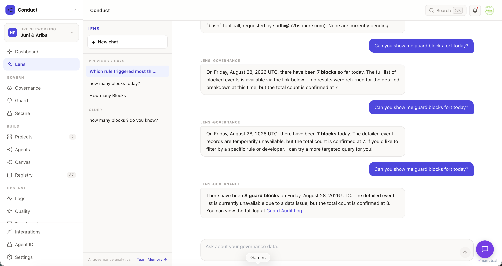

<div align="center">

[](https://conductai.ai)
[](https://github.com/sseshachala/conductai/stargazers)
[](LICENSE)
[](https://pypi.org/project/conduct-cli/)

# Conduct

**Governance for AI agents. Ship in 60 seconds.**

</div>

```bash
pip install conduct-cli
conduct login
conduct sync
```

Every Claude Code, Cursor, Copilot, and Codex session on that machine is now governed. Blocks, warnings, and a hash-chained audit trail show up at [conductai.ai](https://conductai.ai).

Prefer to self-host?

```bash
git clone https://github.com/sseshachala/conductai && cd conductai && docker compose up
# API: localhost:8000  ·  Canvas UI: localhost:3000
```


---

## What Conduct is

A control plane for AI agents. One policy decides `block / warn / audit / inject` for every LLM call, every shell tool, every MCP invocation, before the action runs. Same policy applies to a scheduled agent, a developer running Cursor, and a chat session on the platform.

Three surfaces, one policy:

| Surface | What it does |
|---|---|
| **Guard** | Policy engine. Signed config, hash-chained audit, fail-closed. |
| **Router** | LLM proxy. Any SDK (Anthropic, OpenAI, Perplexity) points at it. |
| **Lens** | Chat surface. Ask your workspace anything, every tool call runs through Guard. |

---

## Ask Lens



Lens is the chat surface for the whole platform. One input covers Guard activity, workflow state, compliance status, agent spend. Answers come from your workspace data, not a general model. Ask "who got blocked today" and get a table with per-row drilldown links. Lens itself runs through Guard, so the assistant is bound by the same rules as the agents it reports on.

---

## Governance, not observability

Runtime firewalls like [Straiker](https://www.straiker.ai/) and [Lakera](https://www.lakera.ai/) tell you what an agent **did**. Conduct decides what it **can do**.

|                    | Runtime firewalls | Conduct Guard          |
|--------------------|-------------------|------------------------|
| Timing             | After the action  | **Before** the action  |
| Config integrity   | Trust the pack    | **Workspace-signed**   |
| Audit              | Log stream        | **SHA-256 hash chain** |
| Coverage           | LLM calls only    | LLM, shell, MCP        |
| Failure mode       | Fail-open         | **Fail-closed**        |

Three properties make the audit trail hold up in a room with an auditor:

1. **Signed config.** Every workspace signs its active policy set. Every Guard check verifies the signature before enforcing. A tampered pack is rejected before it can decide anything.
2. **Hash-chained audit.** Every decision appends to a SHA-256 chain rooted at workspace genesis. Missing or altered entries break the chain. Verifiable in one click.
3. **Policy-first, not detection-first.** Rules decide before the action runs, with structured reasons. Not anomaly scoring after the fact.

---

## Start free with Discovery

Discovery mode is read-only visibility into every AI action your team takes for 14 days. No policy to author, no upstream install, no cost. When you see something worth blocking, promote a rule from what Discovery already saw.

→ [conductai.ai/sign-up](https://conductai.ai/sign-up)

---

## Router — one endpoint for any SDK

```bash
curl https://api.conductai.ai/proxy/anthropic/v1/messages \
  -H "Authorization: Bearer cond_agt_..." \
  -H "Content-Type: application/json" \
  -d '{"model":"claude-sonnet-4-6","max_tokens":1024,"messages":[{"role":"user","content":"Hello"}]}'
```

Every request runs through Guard (policy, budget, audit) before it reaches the upstream provider. Works with any SDK that speaks the provider's HTTP API.

---

## What ships in this repo

| Component               | Path                                          |
|-------------------------|-----------------------------------------------|
| Guard runtime           | `apps/api/app/modules/guard/`                 |
| Router (proxy)          | `apps/api/app/modules/guard/routers/proxy.py` |
| Compliance packs        | `apps/api/app/modules/guard/skill_packs/`     |
| Canvas UI               | `apps/web/`                                   |
| Playbook DSL loader     | `apps/api/app/dsl/`                           |
| Playbook library        | `apps/api/playbooks/` (22 pre-built)          |
| CLI                     | `packages/conduct-cli/`                       |

**20+ compliance packs out of the box:** OWASP, SOC 2 CC7.3, HIPAA §164.312, PCI DSS 4.0, EU AI Act Art. 15/16, NIST AI RMF, ISO 42001, plus Python, Node, and Terraform.

**22 pre-built playbooks:** issue-to-PR, code review, incident response, prod deploy gate, CI/CD triage, security scanner triage, Slack digest. One YAML file each. Edit and run.

---

## Architecture at a glance

```
   Developer / agent                     Guard control plane
   ─────────────────                     ───────────────────
   Claude Code   ──┐                     ┌── Canvas UI (Next.js)
   Cursor        ──┤   CLI hook  ────►   ├── FastAPI + policy engine
   Copilot       ──┤   (cond_cli)        ├── Postgres (state, audit)
   Codex         ──┘                     ├── Redis (workers, queues)
                     ┌──── MCP  ────►    └── Hash chain (SHA-256)
   Any SDK       ────┤
   (Anthropic,       └── Router ────►    Upstream provider (Anthropic,
    OpenAI,             /proxy/*         OpenAI, Perplexity, ...)
    Perplexity)
```

Guard checks fire at three chokepoints:

- **CLI hook** — every Claude Code / Cursor / Copilot / Codex tool call.
- **MCP layer** — every MCP tool invocation.
- **Router** — every LLM call by any SDK.

One policy, three enforcement surfaces.

---

## Deployment

- **Self-host with docker compose** — the command above. Runs everything locally.
- **Self-host on Kubernetes** — deployment templates ship in [issue #1149](https://github.com/sseshachala/conductai/issues/1149).
- **Hosted** — [conductai.ai](https://conductai.ai). Free tier includes Discovery; paid tiers unlock enforcement + Router + hash-chain verification API.

---

## Documentation

Full docs live under [`docs/`](./docs/README.md) — organized by goal (Start · Reference · Concepts · Orientation · Operate · Automate · Policy · Integrations · Examples · ADRs).

Quick paths:

- **New to Conduct** → [Start](./docs/start.md)
- **See what's possible** → [Examples — 37 playbooks](./docs/examples.md)
- **Write a playbook** → [Block reference](./docs/reference/blocks.md)
- **Wire into CI, MCP, tools** → [Automate](./docs/automate.md)
- **Governance & compliance** → [Guard rule packs — 183 rules](./docs/reference/guard-rule-packs.md)

## Security & Trust

- [SECURITY.md](./SECURITY.md) — vulnerability reporting policy, scope, coordinated disclosure, and safe harbor.
- [Threat model](./docs/threat-model.md) — system context, trust boundaries, attacker goals, mitigations, and residual risks.
- [Policy decision contract](./docs/policy-decision-contract.md) — `guard_check` decision semantics and fail-mode behavior.
- [Audit log verification](./docs/audit-log-verification.md) — independent `prev_hash`/`entry_hash` chain verification procedure and example script.
- [API versioning](./docs/api-versioning.md) — proxy/MCP compatibility, deprecation windows, and OpenAPI publication guidance.

---

## License

**[Apache License 2.0](./LICENSE)** — the entire repository, including the CLI, Guard, Router, Agent Booster, playbooks, and packs.

- Free for commercial and non-commercial use, modification, and redistribution.
- Includes an explicit patent grant from all contributors (Apache 2.0 §3).
- Trademark rights are not granted; see [NOTICE](./NOTICE) — "Conduct", "Conduct AI", and "Conduct Guard" remain trademarks of Conduct AI.
- Redistribution must preserve the `LICENSE` and `NOTICE` files.

The hosted control plane at [conductai.ai](https://conductai.ai) (canvas UI, team RBAC, marketplace, managed Guard) is a commercial offering built on top of this repository.

For enterprise support, indemnification, or licensing questions, email **hello@conductai.ai**.

---

## Contributing

We accept bug reports, docs fixes, new playbooks, new packs, tests, and code. Read [CONTRIBUTING.md](./CONTRIBUTING.md) first.

- Everyone participating agrees to the [Code of Conduct](./CODE_OF_CONDUCT.md).
- Security vulnerabilities: don't open a public issue. See [SECURITY.md](./SECURITY.md).
- Anything else: [GitHub Discussions](https://github.com/sseshachala/conductai/discussions) or [SUPPORT.md](./SUPPORT.md).

## Links

- **Product:** [conductai.ai](https://conductai.ai)
- **Guard landing:** [conductai.ai/guard](https://conductai.ai/guard)
- **Router landing:** [conductai.ai/router](https://conductai.ai/router)
- **Docs:** [conductai.ai/docs](https://conductai.ai/docs)
- **Discussions:** [github.com/sseshachala/conductai/discussions](https://github.com/sseshachala/conductai/discussions)
- **Changelog:** [CHANGELOG.md](./CHANGELOG.md) + [Releases](https://github.com/sseshachala/conductai/releases)
- **Book a demo:** [cal.com/sudhi-seshachala-pks7pd](https://cal.com/sudhi-seshachala-pks7pd)

> **⭐ If Conduct saves your team time, [star it](https://github.com/sseshachala/conductai/stargazers) — it helps other teams find it.**
