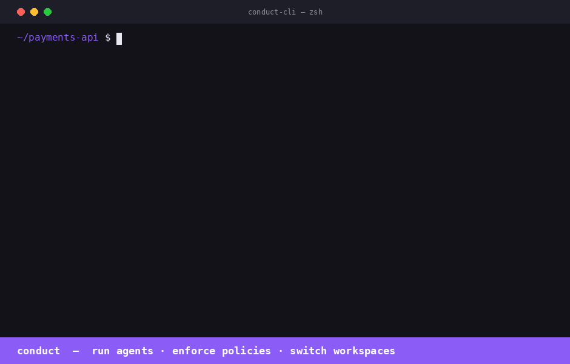

# conduct-cli

Official CLI for [Conduct AI](https://conductai.ai) — install AI agents, manage projects, run end-to-end tests, and enforce team AI policies with ConductGuard.



## Install

```bash
pip install conduct-cli
```

## Quick start

```bash
# Authenticate (one-time)
conduct login \
  --server https://api.conductai.ai \
  --api-key cond_live_xxx \
  --workspace <workspace-id>

# Browse available agents
conduct playbooks

# Create a project and install all agents in one shot
conduct install-all --project DevOps --repo owner/repo

# List installed agents
conduct agents

# Run a test trigger on any agent
conduct test "PR Reviewer"
conduct test --all
```

## Commands

| Command | Description |
|---------|-------------|
| `conduct login` | Save connection config to `~/.conduct/config.json` |
| `conduct projects` | List all projects |
| `conduct create project <name>` | Create a project |
| `conduct delete project <name>` | Delete a project and all its agents |
| `conduct reset project <name>` | Delete all agents in a project (clean slate) |
| `conduct playbooks` | Browse available playbooks |
| `conduct playbooks <slug>` | Show required inputs for a playbook |
| `conduct install <slug>` | Install one agent from a playbook |
| `conduct install-all` | Install all 12 playbooks into a project |
| `conduct agents` | List all installed agents |
| `conduct test <name>` | Fire test trigger on an agent and stream results |
| `conduct test --all` | Test every playbook-based agent |

## Authentication

Generate an API key from **Settings → API Keys** in the Conduct AI dashboard. Keys start with `cond_live_` and are stored as SHA-256 hashes — the plaintext is shown only once.

```bash
conduct login --server https://api.conductai.ai --api-key cond_live_xxx --workspace <id>
```

## Install all agents

```bash
# Installs all 12 playbooks into a project, pointed at your GitHub repo
conduct install-all --project DevOps --repo myorg/myrepo
```

If the project doesn't exist it's created automatically. Use `--input key=value` to override any playbook input.

## Test agents

```bash
# Test a single agent (fires synthetic test payload, streams run events)
conduct test "Autopilot Quick"

# Test all playbook-based agents in sequence
conduct test --all
```

Exit code is `0` if all pass, `1` if any fail — works in CI.

---

## ConductGuard

ConductGuard is AI tool fleet management — your security team sets policies once and they're enforced automatically across every developer's Claude Code, Cursor, and Windsurf session.

### How it works

```
Admin configures policies and budgets in the Guard dashboard
    └─ developers are workspace members automatically — no invite step needed

Developer runs: conduct guard sync
    ├─ pulls latest policy to ~/.conductguard/policy.json
    ├─ writes PreToolUse hook → ~/.conductguard/hook.py
    ├─ registers hook → ~/.claude/settings.json
    └─ registers conductguard-mcp → ~/.claude/settings.json (mcpServers) + Codex

Every Claude Code tool call:
    ├─ PreToolUse hook fires (hook.py) → checks policy → block / warn / audit
    └─ Event posted async to ConductGuard API → visible in Activity feed
```

### Developer setup

```bash
pip install conduct-cli

# Authenticate (already done if you use Conduct)
conduct login --server https://api.conductai.ai --api-key <api-key>

# Sync Guard — installs hook + MCP, pulls policies
conduct guard sync
```

That's it. Policy enforcement is active from the next tool call.

### Guard commands

| Command | Description |
|---------|-------------|
| `conduct guard sync` | Pull latest policy, write hook to `~/.conductguard/hook.py`, register hook + MCP |
| `conduct guard status` | Show today's spend, session count, and violations |
| `conduct guard audit [--since 7d]` | Print recent guard events in a table |

### How the PreToolUse hook works

When you run `conduct guard sync`, the CLI writes a Python script to `~/.conductguard/hook.py` and registers it as a `PreToolUse` hook in `~/.claude/settings.json`:

```json
{
  "hooks": {
    "PreToolUse": [
      {
        "matcher": ".*",
        "hooks": [{ "type": "command", "command": "python3 ~/.conductguard/hook.py" }]
      }
    ]
  }
}
```

Before every tool call, Claude Code runs the hook. The hook:

1. Reads `tool_name` and `tool_input` from stdin (JSON)
2. Loads `~/.conductguard/policy.json` (the team ruleset)
3. Matches the call against each rule (`match_tool`, `match_pattern`, `match_path_pattern`)
4. Takes the rule's action:
   - `block` — prints the policy message, exits with code `2` (Claude Code aborts the tool call)
   - `warn` — prints the message, exits `0` (tool call proceeds, developer is notified)
   - `audit` — posts an event silently, exits `0`
5. Posts an audit event to `POST /guard/events` asynchronously (fire-and-forget, never slows the tool call)

### How conductguard-mcp works

`conduct guard sync` also registers an MCP server entry in `~/.claude/settings.json`:

```json
{
  "mcpServers": {
    "conductguard": {
      "command": "conductguard-mcp",
      "args": ["--team", "<team-id>", "--token", "<member-token>"]
    }
  }
}
```

Claude Code starts `conductguard-mcp` as a subprocess on launch and keeps it running. It communicates via JSON-RPC 2.0 over stdin/stdout (MCP stdio transport).

The MCP server exposes three tools that Claude can call proactively:

| Tool | Description |
|------|-------------|
| `guard_status` | Returns team name, your email, number of active rules, and policy version |
| `guard_check` | Checks whether a specific tool + input would be blocked before Claude acts |
| `guard_sync` | Fetches the latest policy from the ConductGuard API and saves it locally |

**`guard_check` example** — Claude can self-check before a sensitive action:

```
guard_check(tool_name="bash", tool_input={"command": "rm -rf /tmp/build"})
→ ALLOWED — no policy rule matches 'bash'.

guard_check(tool_name="bash", tool_input={"command": "curl http://internal-api/secrets"})
→ BLOCKED — External network calls to internal endpoints are not permitted. [rule: no-internal-curl]
```

**`guard_sync` example** — after your security team pushes new rules:

```
guard_sync()
→ Policy synced — 12 rule(s) active (version: 2026-05-31T14:22:00Z).
```

### Policy file format

Policy is stored at `~/.conductguard/policy.json` and synced from the server:

```json
{
  "team_id": "uuid",
  "version": "2026-05-31T14:22:00Z",
  "rules": [
    {
      "rule_id": "no-rm-rf",
      "match_tool": "bash",
      "match_pattern": "rm\\s+-rf",
      "match_path_pattern": null,
      "action": "block",
      "message": "Recursive deletes are not permitted. Use trash or targeted rm."
    },
    {
      "rule_id": "audit-prod-writes",
      "match_tool": "edit,write",
      "match_path_pattern": "/prod/",
      "match_pattern": null,
      "action": "warn",
      "message": "Writing to prod directory — make sure this is intentional."
    }
  ]
}
```

### Keeping policy up to date

Run `conduct guard sync` after your security team updates rules in the ConductGuard dashboard. The sync command pulls the latest policy, rewrites the hook, and re-registers the MCP entry in any newly detected AI tool configs.

```bash
# Add to a daily cron or run manually after policy changes
conduct guard sync
```

---

## Claude Desktop

Add to `~/Library/Application Support/Claude/claude_desktop_config.json` (macOS) or `%APPDATA%\Claude\claude_desktop_config.json` (Windows):

```json
{
  "mcpServers": {
    "conduct": {
      "command": "conduct-mcp",
      "args": []
    },
    "conductguard": {
      "command": "conductguard-mcp",
      "args": ["--team", "<workspace-id>", "--token", "<member-token>"]
    }
  }
}
```

Run `conduct login` first — `conduct-mcp` reads credentials from `~/.conduct/config.json`. Get your member token from **Settings → API Keys** in the Conduct AI dashboard.

---

## Links

- Dashboard: [conductai.ai](https://conductai.ai)
- Docs: [conductai.ai/docs](https://conductai.ai/docs)
- Issues: [github.com/sseshachala/conductai/issues](https://github.com/sseshachala/conductai/issues)
