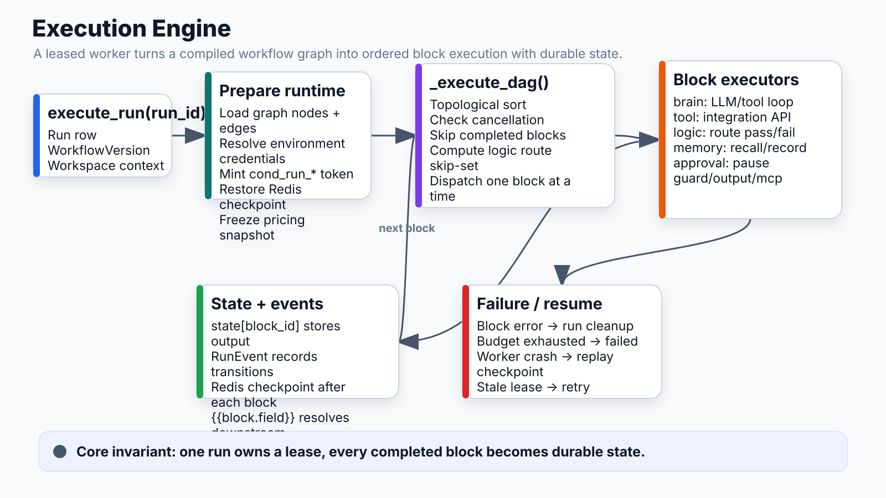

# Execution Engine



## What it does
Executes workflow DAGs block-by-block, translating YAML playbooks into a deterministic topological execution with state accumulation, leasing, and resume support.

## Entry point
`execute_run(run_id)` in `apps/api/app/runtime/executor.py`

## Key data structures

| Structure | Description |
|---|---|
| `Run` | Tracks status (pending/running/succeeded/failed), accumulated state dict, current block, turn/cost budget |
| `WorkflowVersion` | Cached graph (nodes + edges) + YAML source + compiled_artifacts (per-block prompts) |
| `RunEvent` | Stream of state transitions (block_started, block_completed, block_failed) with payload |
| `RunTrace` | Per-turn LLM trace: user content, assistant response, token counts |

## Execution flow

```
execute_run(run_id)
  │
  ├─ Load WorkflowVersion (graph = {nodes, edges})
  ├─ Resolve environment_id → load credentials (Integration table)
  ├─ Mint cond_run_* token, inject into env_vars
  ├─ Load Redis checkpoint (resume support — skip already-completed blocks)
  │
  └─ _execute_dag()
       │
       ├─ Topological sort nodes
       ├─ For each block:
       │   ├─ Check cancellation
       │   ├─ Skip if in state (resume)
       │   ├─ Compute skip-set from logic routes
       │   ├─ Emit block_started
       │   ├─ _dispatch_single_block()
       │   │   ├─ brain → _execute_brain()
       │   │   ├─ tool → _execute_tool()
       │   │   ├─ logic → _execute_logic()
       │   │   ├─ memory → _execute_memory()
       │   │   ├─ approval → _execute_approval() [pauses run]
       │   │   ├─ guard → _execute_guard()
       │   │   ├─ output → _execute_output()
       │   │   └─ mcp → _execute_mcp()
       │   ├─ Merge result into state[block_id]
       │   └─ Emit block_completed / block_failed
       │
       └─ On any failure → run cleanup blocks (guaranteed)
```

## Key decisions

### State accumulation
- Every block result is merged into a flat `state` dict keyed by `block_id`
- Downstream blocks read upstream outputs via `{{block_id.field}}` (resolved by `_resolve_refs`)
- State is checkpointed to Redis after each block — survives worker crashes

### Logic routing
- Logic blocks evaluate a Jinja condition against state → route `pass` or `fail`
- A skip-set is computed by forward BFS from entry points; any block unreachable via live edges is skipped
- Convergent paths handled: a block reachable via one live path is not skipped even if another path to it is dead

### Credential loading
```
workflow.environment_id
  → integrations WHERE environment_id = X
  → fallback: integrations WHERE environment_id = NULL (Default env)
  → merge: missing handles filled from Default
```

### Run leasing (distributed workers)
- `locked_at`, `locked_by`, `next_retry_at`, `attempt_count` prevent double-execution
- Stale leases released after timeout; run retried up to max_attempts

### Outcome detection
- After success: check if `playbook_slug` maps to a known artifact key (`pr_url`, `issue_url`)
- If artifact found in state → record outcome for analytics flywheel

## Failure modes

| Failure | Effect |
|---|---|
| Block raises exception | block_failed emitted, cleanup blocks run, run → failed |
| Budget exhausted (turns/cost) | RuntimeError propagated, same as block failure |
| Guard BLOCK decision | 403 returned, run fails at that block |
| Worker crash mid-block | Redis checkpoint replays from last completed block |
| Cancellation | Checked between blocks; run → cancelled gracefully |

## Connects to
- **DSL/Compiler**: produces `{nodes, edges}` graph the executor consumes
- **Brain block**: main workhorse for AI reasoning
- **Guard proxy**: every LLM call routes through it
- **Memory block**: recall/record before and after agentic work
- **Pricing**: per-call cost tracked, aggregated to run total
