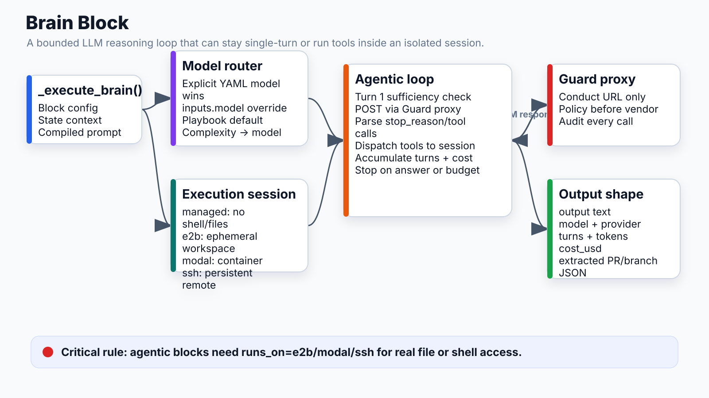

# Brain Block (LLM Reasoning)



## What it does
Bounded agentic loop — single LLM call (mode: single) or multi-turn tool-use loop (mode: agentic) with turn budget, cost cap, credential isolation, and proxy routing.

## Location
`apps/api/app/runtime/blocks/brain_block.py` → `_execute_brain()`

## Execution flow

```
_execute_brain(block, state, ...)
  │
  ├─ Resolve model + provider (router)
  ├─ Build system prompt (compiled_artifacts or description)
  ├─ Inject credential placeholders (real values hidden from LLM)
  ├─ Create session (E2B / Modal / SSH / None)
  │
  └─ Agentic loop:
       ├─ Turn 1: sufficiency check → pause if "NEEDS_CLARIFICATION:"
       ├─ Call LLM via Guard proxy (Conduct URL, never direct vendor)
       ├─ If stop_reason == "end_turn" or no tool_calls → exit loop
       ├─ Dispatch tool calls to session
       ├─ Accumulate cost + turn count
       ├─ Check budget (turns >= max_turns OR cost >= max_cost_usd) → stop
       └─ Repeat
```

## Model routing

```
Explicit model in YAML (highest priority)
  → e.g. complexity conditional:
     large → claude-opus-4-7
     medium → claude-sonnet-4-6
     small → claude-haiku-4-5-20251001

inputs.model (user-supplied at run time)
  → default: claude-haiku-4-5-20251001

Playbook default from Router
  → routing_pref: balanced / cost / quality
```

All calls route through `settings.conduct_proxy_url/{provider}` — never directly to Anthropic/OpenAI.

## Execution mode (`runs_on`)

| Mode | Effect |
|---|---|
| not set (managed) | LLM only — NO shell, NO file access. Agent can reason but cannot act. Exits in 1 turn if it needs tools. |
| `e2b` | Ephemeral E2B container. Fresh /workspace per run. Full shell + git + file tools. |
| `modal` | Modal Labs container. Same capabilities as E2B. |
| SSH remote | DigitalOcean or any SSH host. Persistent workspace across turns within a block. |

**Critical:** Agentic blocks without `runs_on` cannot clone repos, edit files, or run tests. They will assess in 1 turn and exit.

## Turn budget

```
Priority order:
1. block.max_turns (explicit in YAML)
2. state.__max_turns (run-level override)
3. Complexity-derived (agent_config.yaml):
   large → 100, medium → 50, small → 25
4. Default: 20

Hard cost cap: max_cost_usd (state.__max_cost_usd or $5.00)
```

## Credential isolation

LLM and logs **never** see real secrets. Pattern:
```
Real value: ghp_abc123 (GIT_TOKEN)
LLM sees:   __CREDENTIAL_GIT_TOKEN__
Shell env:  GIT_TOKEN=ghp_abc123  ← swapped at dispatch time only
```

Credentials resolved from `credentials["github"]["token"]` → env var name via mapping table.

## Headers sent to Guard proxy

| Header | Value |
|---|---|
| `x-conductai-run-id` | Current run UUID |
| `x-conductai-workspace-id` | Workspace UUID |
| `x-conductai-environment-id` | Environment UUID (for upstream URL lookup) |
| `x-conductai-internal` | `cond_run_*` or `cond_agt_*` token |
| `x-conductai-workflow` | Workflow name |
| `x-conductai-user-email` | Triggering user email |

## Output shape

```json
{
  "output": "<LLM text output>",
  "model": "claude-haiku-4-5-20251001",
  "provider": "anthropic",
  "turns": 3,
  "input_tokens": 1200,
  "output_tokens": 450,
  "cost_usd": 0.0012,
  "upstream_url": "https://api.conductai.ai/proxy/anthropic",
  "llm_upstream": "https://api.portkey.ai/v1",
  "routing_reason": "complexity=medium → sonnet",
  "pr_url": "...",       ← extracted from last JSON object in output
  "branch_name": "..."   ← extracted from last JSON object in output
}
```

## Connects to
- **Guard proxy**: all LLM traffic, pre-call policy check
- **Model router**: provider/model selection
- **Pricing**: per-call cost calculation
- **Session (E2B/Modal/SSH)**: tool call dispatch
- **Executor**: complexity → max_turns injection before block runs
