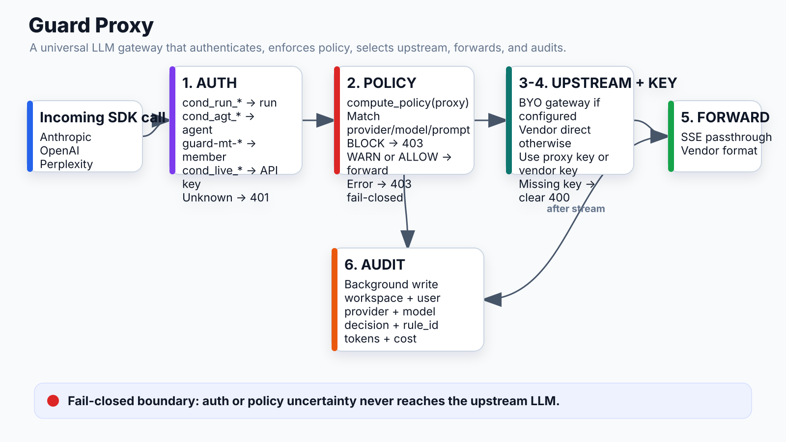

# Guard Proxy (LLM Gateway)



## What it does
Universal LLM API gateway. Receives calls via standard SDK env vars (`ANTHROPIC_BASE_URL`, `OPENAI_BASE_URL`), resolves caller identity, enforces policies, and forwards to the right upstream with a full audit trail.

## Location
`apps/api/app/modules/guard/routers/proxy.py`

## Endpoints

| Endpoint | SDK var |
|---|---|
| `POST /proxy/anthropic/v1/messages` | `ANTHROPIC_BASE_URL` |
| `POST /proxy/openai/v1/chat/completions` | `OPENAI_BASE_URL` |
| `POST /proxy/perplexity/chat/completions` | `PERPLEXITY_BASE_URL` |

## Decision chain (every LLM call)

```
Incoming request
  │
  1. AUTH — who is calling?
  │   ├─ cond_run_* token  → run context (workspace_id + run_id)
  │   ├─ cond_agt_* token  → agent identity (workspace_id)
  │   ├─ guard-mt-* token  → member token (CLI identity)
  │   └─ cond_live_* key   → workspace API key
  │   Fail → 401 (fail-closed, never forward)
  │
  2. POLICY — is this call allowed?
  │   compute_policy(workspace_id, "proxy") → rules
  │   Match: provider + model + prompt (regex)
  │   First match wins:
  │   ├─ BLOCK  → 403, audit event, stop
  │   ├─ WARN   → audit event, forward
  │   └─ ALLOW  → audit event, forward
  │   Error → 403 (fail-closed)
  │
  3. UPSTREAM — where to forward?
  │   PROXY_CONFIG_LLM_UPSTREAM in env_vars (for environment_id)?
  │   ├─ Set  → BYO gateway (Portkey / Helicone / Azure / LiteLLM)
  │   └─ Not set → vendor API directly (api.anthropic.com etc.)
  │
  4. KEY — which API key?
  │   BYO gateway set?
  │   ├─ Yes → PROXY_CONFIG_LLM_UPSTREAM_API_KEY (from env_vars)
  │   └─ No  → ANTHROPIC_API_KEY / OPENAI_API_KEY (from env_vars or provider integration)
  │
  5. FORWARD → StreamingResponse (SSE pass-through)
  │
  6. AUDIT (background, after stream closes)
      guard_audit_events row: workspace, user, tool, provider, model,
      decision, rule_id, tokens, cost, run_id linkage
```

## Proxy config storage

Proxy config (LLM upstream URL + key) lives in its own Integration handle:
```
handle = "proxy_config", environment_id = NULL  ← workspace-level (Settings → Proxy)
```

Pushed to environments via `POST /guard/proxy-config/push`:
```
env_vars[PROXY_CONFIG_LLM_UPSTREAM]         ← runtime reads this
env_vars[PROXY_CONFIG_LLM_UPSTREAM_API_KEY] ← runtime reads this
```

## Run trace badges

Every brain block in the run trace shows:
- Grey badge: `via api.conductai.ai` — Guard layer (always present)
- Purple badge: `→ api.portkey.ai` — LLM upstream (only when PROXY_CONFIG_LLM_UPSTREAM is set)

Both values appear in raw output as `upstream_url` and `llm_upstream`.

## Audit event

```sql
guard_audit_events:
  workspace_id, clerk_user_id, ai_tool, source ('proxy'),
  provider, model, decision (ALLOW/BLOCK/WARN), rule_id,
  tokens_before, tokens_after, cost_usd_after,
  input_summary, conductai_run_id, conductai_workflow_id, ts
```

## Failure modes

| Failure | Effect |
|---|---|
| Token not recognized | 401, fail-closed |
| Policy compute error | 403, fail-closed (never forward on uncertainty) |
| Upstream unreachable | 502 forwarded back to caller |
| No API key found | 400 with clear error message |

## Connects to
- **Policy engine**: `compute_policy(workspace_id, "proxy")`
- **Brain block**: receives all LLM calls via `x-conductai-*` headers
- **Agent identity**: token resolution
- **Environment**: `PROXY_CONFIG_*` env vars determine upstream
- **Guard activity feed**: audit events power the UI
