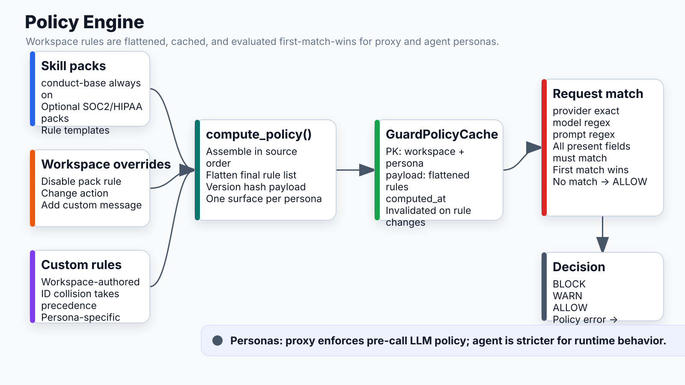

# Policy Engine



## What it does
Evaluates security rules per workspace + persona. Assembles rules from skill packs + workspace overrides + custom rules, caches the result, and returns a decision per LLM call.

## Location
`apps/api/app/modules/guard/policy_engine.py`

## Rule sources (evaluated in order)

```
1. Skill packs (conduct-base + installed packs)
   → base rules shipped with Conduct (always on)
   → optional packs: conduct-soc2, conduct-hipaa, etc.

2. Workspace overrides (GuardRuleOverride)
   → temporarily disable a pack rule
   → temporarily weaken an action (BLOCK → WARN)
   → strengthen an action without an exception deadline
   → add custom message

3. Workspace custom rules (WorkspaceCustomRule)
   → rules the workspace wrote themselves
   → take precedence over pack rules on ID collision
```

## Personas

| Persona | Used by | Enforcement |
|---|---|---|
| `proxy` | Guard proxy (LLM gateway) | Only proxy-routed request text with proxy-compatible matchers |
| `agent` | Hooks, MCP guard checks, and workflow runtime | Capability varies by surface and matcher |

## Rule shape

```json
{
  "id": "no-pii-in-prompt",
  "persona": "proxy",
  "match_provider": "anthropic",
  "match_model": ".*",
  "match_prompt": "(SSN|social security|credit card)",
  "action": "block",
  "message": "PII detected in prompt",
  "severity": "high",
  "enforcement": {
    "version": 1,
    "proxy": "hard",
    "hook": "not_supported",
    "mcp": "not_supported",
    "runtime": "not_supported",
    "guarantee": "Blocks matching proxy-routed request text before provider forwarding.",
    "requires": ["LLM traffic is routed through the Conduct Guard Proxy"],
    "known_limitations": ["Image content and text absent from the request body are not inspected"]
  }
}
```

Match fields are optional. Missing field = match all. All present fields must match (AND logic). First rule match wins.

The `enforcement` object is the versioned capability contract consumed by the
API, CI validation, and generated evidence documentation. `hard` means the
surface prevents a match once traffic reaches that surface; `conditional`
names an installation/invocation dependency; `advisory` warns or audits; and
`not_supported` means the current enforcer cannot evaluate the required
content or semantics. Workspace action overrides and exceptions change the
effective policy, not the underlying surface capability claim.

The workspace matrix is available from authenticated
`GET /guard/policies/coverage` (`guard.policies.view`). The checked-in evidence
document is generated at
`docs/modules/conductguard/enforcement_coverage.generated.md`.

## Policy cache

```
GuardPolicyCache:
  workspace_id, persona, payload (flattened rules JSON), version_hash, computed_at

Invalidated on:
  - Pack install / remove
  - Rule override change
  - Custom rule add / edit / delete
  - Persona config change
```

Cache miss → recompute from DB → cache result. Cache hit → return immediately (no DB query per LLM call).

### Time-bounded policy exceptions

Disabling a pack rule or changing it to a less restrictive action requires
both a non-empty `reason` and a future, timezone-aware `expires_at`. Action
restrictiveness is ordered:

```
allow < audit < inject < warn < approval < block
```

Unknown actions are rejected. When an exception expires, `compute_policy()`
automatically stops applying it and restores the pack rule; no cleanup job is
required. Message-only customization and equal or stronger action changes are
not security exceptions and may remain indefinite. Policy list responses keep
the exception metadata and expose `exception_active` / `exception_expired` so
an expired exception remains visible even though it no longer affects policy.

## Decision flow

```
compute_policy(workspace_id, persona) → rule_list

For each rule in rule_list:
  match_provider? → exact match on "anthropic" / "openai" / "perplexity"
  match_model?    → regex on model name
  match_prompt?   → regex on request body prompt text
  match_tool?     → skip (hook rules, not LLM call rules)

  If all present fields match:
    → return {action, rule_id, message}
    STOP (first match wins)

No match → ALLOW
```

## Enforcement modes

| Mode | Effect |
|---|---|
| `block` | 403 returned, call not forwarded, audit event written |
| `warn` | Audit event written, call forwarded |
| `allow` | Audit event written, call forwarded |
| Policy error | 403, fail-closed — never forward on uncertainty |

## Connects to
- **Guard proxy**: calls `compute_policy` on every LLM request
- **Skill packs**: catalog of rule templates
- **Workspace config**: enforcement_mode, fail_mode, runtime_persona
- **Audit events**: every decision logged to guard_audit_events
