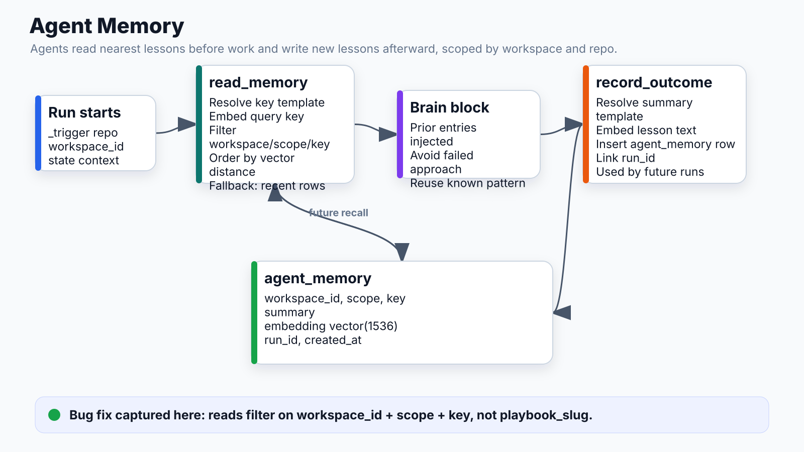

# Agent Memory



## What it does
Read/write persistent memory with vector similarity search. Agents recall past run summaries before acting and record lessons after. Memory accumulates across runs, making agents smarter over time on the same repos.

## Location
`apps/api/app/runtime/blocks/memory_block.py`

## Data model

```sql
agent_memory:
  workspace_id   UUID      -- scoped to workspace
  scope          TEXT      -- "repo" | "workspace"
  key            TEXT      -- template-resolved (e.g. "owner/repo-name")
  summary        TEXT      -- human-readable lesson from the run
  embedding      vector(1536)  -- pgvector, OpenAI text-embedding-3-small
  run_id         UUID      -- which run wrote this
  created_at     TIMESTAMP
```

## Read action

```
read_memory block:
  key:   "{{_trigger.repo_full_name}}"  → "sseshachala/conductai"
  scope: repo
  limit: 5

Query path:
  1. Embed key via OpenAI client
  2. SELECT summary FROM agent_memory
     WHERE workspace_id = X AND scope = Y AND key = Z AND embedding IS NOT NULL
     ORDER BY (embedding <=> query_vec) ASC   ← nearest neighbors
     LIMIT 5

  Fallback (no embedding client or dimension mismatch):
     ORDER BY created_at DESC
     LIMIT 5

Output: {entries: [{summary, at}], count, scope, key}
```

## Write action

```
record_outcome block:
  key:     "{{_trigger.repo_full_name}}"
  scope:   repo
  summary: "Complexity: medium | Approach: move migration to preDeployCommand |
            Prior fixes: 0 | Lesson: render.yaml startCommand must not include alembic"

Write path:
  1. Resolve summary template
  2. Embed summary via OpenAI client (if available)
  3. INSERT INTO agent_memory (workspace_id, scope, key, summary, embedding, run_id)
```

## Scope definitions

| Scope | Key pattern | Use case |
|---|---|---|
| `repo` | `owner/repo-name` | Per-repo learnings (test runner, file layout, gotchas) |
| `workspace` | Any string | Cross-project patterns (coding style, team conventions) |

## How agents use memory

In `autopilot.yaml`:
```
[read_memory] → entries injected into implement_fix description:

"Prior runs on THIS repo — read carefully:
- Complexity: small | Lesson: test runner is pytest, not npm test
- Complexity: medium | Lesson: git push 403 — token needs workflow scope"

Rules:
1. If prior entry shows OUTCOME: failed → don't repeat same approach
2. If prior entry shows success pattern → reuse it
3. If prior entry mentions a gotcha → preempt it
```

## Why count=0 was a bug

Old code filtered on `playbook_slug` — different workflow installs had different slugs, so writes were never found by reads. Fixed: filter on `workspace_id + scope + key` only.

## Connects to
- **Brain block**: `read_memory.entries` available in `{{...}}` template refs
- **Executor**: memory blocks dispatched like any other block type
- **Embedding client**: OpenAI text-embedding-3-small (1536d) or Voyage (512d, recency fallback)
- **pgvector**: HNSW index for fast ANN search
