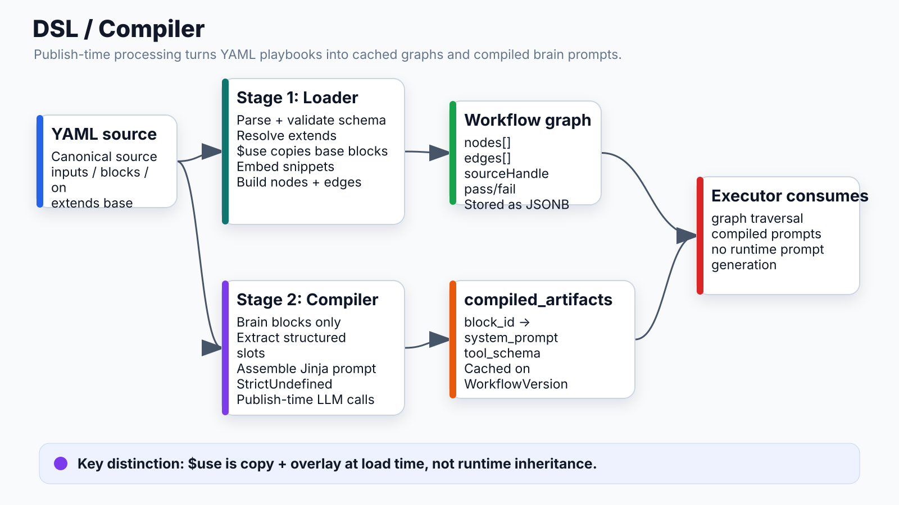

# DSL / Compiler



## What it does
Transforms YAML playbooks into executable DAGs. Two-stage pipeline: DSL loader resolves inheritance and templates; compiler extracts structured prompts from English descriptions for Brain blocks.

## Locations
- `apps/api/app/dsl/loader.py` — YAML → graph
- `apps/api/app/dsl/schema.py` — Pydantic models
- `apps/api/app/compiler/compiler.py` — prompt compilation

## Stage 1: DSL Loader (YAML → Graph)

```
load_workflow_yaml(yaml_source)
  │
  1. Parse YAML, validate against schema.py Pydantic models
  │
  2. Resolve extends: base-autopilot
  │   ├─ Load base file (kind: base, not executable)
  │   ├─ For each block with $use: base-autopilot.block_id
  │   │   └─ Copy base block fields; child fields override
  │   └─ Embed {{$snippet: name}} → raw multiline text from base.snippets
  │
  3. Produce graph:
      {
        "nodes": [{"id": str, "type": "block", "data": {...}}, ...],
        "edges": [{"id": str, "source": str, "target": str,
                   "sourceHandle": "pass" | None}, ...]
      }
```

Stored in `WorkflowVersion.graph` (JSONB). `yaml_source` is canonical — graph is cached and can be rebuilt.

## $use — Block Inheritance

```yaml
# base-autopilot.yaml (kind: base)
snippets:
  detect_mode: |
    if [ -d /workspace/.git ]; then echo sandbox; else echo proxy; fi

blocks:
  clone_repo:
    type: tool
    integration: github
    action: clone

# child playbook
extends: base-autopilot

blocks:
  clone:
    $use: base-autopilot.clone_repo   # copies template
    params:
      depth: "{{inputs.clone_depth}}" # child fields override
```

Key rules:
- Base files never execute (`kind: base`)
- `$use` is a copy + overlay, not runtime inheritance
- Snippets are string literals embedded inline in descriptions via `{{$snippet: name}}`

## Stage 2: Compiler (Description → Prompt)

Brain blocks only. Two LLM calls per compilation:

```
1. Extraction (Claude Sonnet, tool use):
   English description → structured slots:
   { goal, constraints, output_description, key_actions, parameters }

2. Assembly (Jinja2):
   slots + block config → final system_prompt
   Templates: apps/api/app/compiler/prompts/*.jinja2
   Mode: StrictUndefined (missing vars fail loudly)
```

Output stored in `WorkflowVersion.compiled_artifacts` (JSONB):
```json
{
  "implement_fix": {
    "system_prompt": "You are an autonomous engineer...",
    "tool_schema": {...}
  },
  "plan_fix": {
    "system_prompt": "Analyze the issue and output JSON...",
    "tool_schema": {...}
  }
}
```

Compilation happens once on publish. Executor reads `compiled_artifacts` — no LLM call at run time for prompt generation.

## Schema — Key Types

```
SUPPORTED_BLOCK_TYPES = {
  "tool", "brain", "logic", "approval",
  "memory", "output", "guard", "mcp", "trigger", "cleanup"
}

WorkflowParam:
  type: string | select | boolean | integer
  required_at: "install" | "run" | "dry_run"
  default: any
```

## Connects to
- **Executor**: consumes `{nodes, edges}` graph and `compiled_artifacts`
- **Brain block**: reads compiled system_prompt for each turn
- **Playbooks**: YAML source checked into `apps/api/playbooks/`
