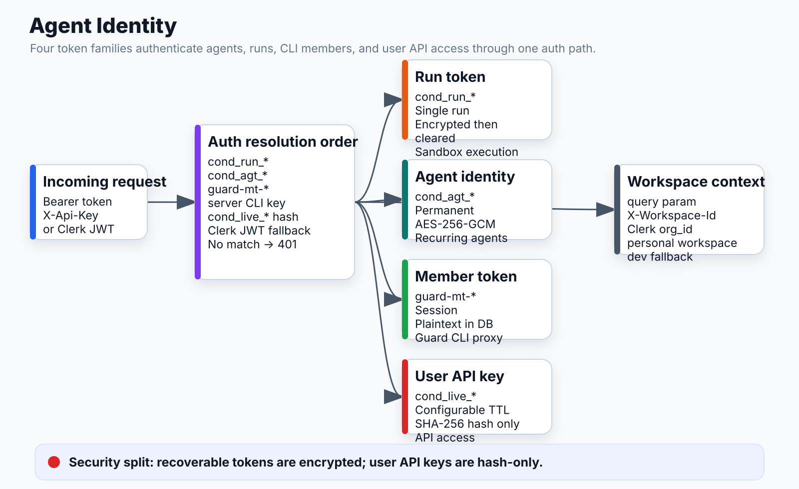

# Agent Identity



## What it does
Issues and validates four types of tokens that authenticate callers across the system. Long-lived identities for agents; ephemeral run tokens for sandbox execution; member tokens for the Guard proxy; API keys for users.

## Locations
- `apps/api/app/modules/agent_identity/` — models, adapters, router
- `apps/api/app/core/auth.py` — token verification (all four types)
- `apps/api/app/routers/workflows.py` — cond_run_* minting at trigger time

## Token Matrix

| Token | Prefix | TTL | Storage | Used by |
|---|---|---|---|---|
| Agent identity | `cond_agt_*` | Permanent | AES-256-GCM encrypted | Recurring agents |
| Run token | `cond_run_*` | Single run | Encrypted → cleared after use | Sandbox execution |
| Member token | `guard-mt-*` | Session | Plaintext in DB | Guard proxy (CLI) |
| API key | `cond_live_*` | Configurable | SHA-256 hash only | User API access |

## cond_agt_* — Long-lived Agent Identity

```
POST /workspaces/{ws}/agent-identities
  → AgentIdentity row
      token_prefix:    "cond_agt_" + first 8 hex chars  (indexed)
      token_encrypted: AES-256-GCM(32-byte random)
      environment_id:  nullable (scopes which env vars it sees)
      last_used_at:    updated on every use

Regenerate: POST /agent-identities/{id}/regenerate
  → new random bytes, new token_encrypted
  → old token immediately invalid
```

## cond_run_* — Ephemeral Run Token

```
POST /workflows/{id}/trigger
  → mints one cond_run_* per run
      token_hash:      SHA-256 (fast lookup)
      token_encrypted: AES-256-GCM (given to executor)
      invalidated_at:  set when run completes
      token_encrypted: → NULL after executor first reads it
```

One-time use. Executor reads it once, then the column is cleared. Prevents leakage via DB backups or logs.

## guard-mt-* — Guard Member Token

Issued by `conduct guard sync` (CLI). One per user per workspace. Stored plaintext in `guard_member_config`. Used only for Guard proxy auth, never for workflow runs.

## cond_live_* — User API Key

```
Stored as: SHA-256(plaintext) in ConductApiKey.key_hash
Plaintext:  never persisted
expires_at: optional
last_used_at: updated async (best-effort, doesn't block)
```

## Auth Resolution Order (every request)

```
Incoming request
  │
  1. Bearer / X-Api-Key header
  │   ├─ Starts with cond_run_ → lookup AgentRunToken by prefix
  │   ├─ Starts with cond_agt_ → lookup AgentIdentity by prefix
  │   ├─ Starts with guard-mt- → lookup guard_member_config
  │   ├─ Matches settings.cli_api_key → server key (CLI)
  │   └─ SHA-256 hash match in ConductApiKey → user key
  │
  2. Clerk JWT (Authorization: Bearer <jwt>)
  │   → verify RS256 via JWKS, extract sub + org_id
  │
  3. No match → 401 (fail-closed)
```

## Workspace Resolution

```python
get_workspace_id(request):
  1. ?workspace_id= query param
  2. X-Workspace-Id header
  3. Clerk JWT org_id claim
  4. Clerk JWT sub (personal workspace)
  5. Dev workspace (if Clerk disabled)
```

## Connects to
- **Guard proxy**: validates guard-mt-* + cond_run_* on every LLM call
- **Executor**: mints cond_run_*, passes to sandbox via env var
- **Brain block**: sends cond_run_* in x-conductai-internal header to Guard proxy
- **Auth core**: single resolution path for all token types
