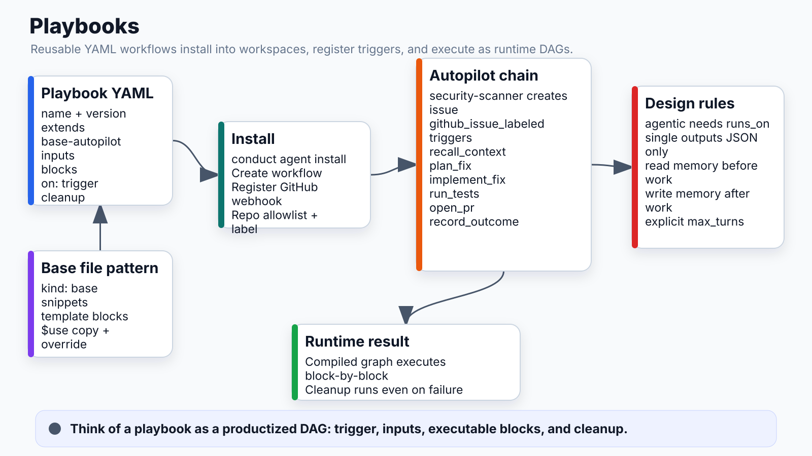

# Playbooks



## What it does
YAML files that define reusable AI agent workflows. Installed into workspaces, triggered by webhooks or manually, executed as DAGs by the runtime.

## Location
`apps/api/playbooks/` — all built-in playbooks

## Standard Structure

```yaml
name: Autopilot — GitHub Issues
version: 2
extends: base-autopilot        # inherit template blocks + snippets

inputs:
  repo:
    label: GitHub repository
    type: string
    required_at: run            # prompted at trigger time
  trigger_label:
    label: Trigger label
    default: "autopilot ready"
    type: select
    options: ["autopilot ready", "conduct"]
  model:
    label: AI Model
    default: claude-haiku-4-5-20251001
    type: select

blocks:
  plan_fix:
    type: brain
    mode: single                # single-turn JSON output
    description: Analyze the issue. Output JSON with complexity and approach.

  implement_fix:
    type: brain
    mode: agentic               # multi-turn tool loop
    runs_on: e2b                # REQUIRED for real file/shell access
    max_turns: 50
    model: >-
      claude-opus-4-7
      claude-sonnet-4-6
      claude-haiku-4-5-20251001
    description: Implement the fix. Clone repo, edit files, run tests, open PR.

  record_outcome:
    type: memory
    action: record_outcome
    key: "{{_trigger.repo_full_name}}"
    scope: repo
    summary: "Complexity: {{plan_fix.complexity}} | Lesson: ..."

on:
  github_issue_labeled:
    repo_allowlist: owner/repo
    label: "{{inputs.trigger_label}}"

cleanup:
  - destroy_sandbox             # always runs even on failure
```

## Autopilot Chain

```
security-scanner (separate workflow, secure branch)
  → detects vulnerability
  → creates GitHub issue with label "autopilot ready"
  ↓
autopilot.yaml triggered by github_issue_labeled
  ↓
  recall_context  (memory: read prior runs on this repo)
  plan_fix        (brain: single-turn → JSON {complexity, approach})
  implement_fix   (brain: agentic, E2B, many turns → code changes)
  run_tests       (brain: agentic, E2B → verify fix passes)
  open_pr         (tool: github → create pull request)
  record_outcome  (memory: write lesson for next run)
```

## Base File Pattern

`base-autopilot.yaml` (`kind: base`, not executable):

```yaml
kind: base
name: base-autopilot

snippets:
  detect_mode: |
    if [ -d /workspace/.git ]; then echo "MODE=sandbox"
    else echo "MODE=proxy"; fi
  
  clone_repo: |
    git clone https://$GIT_TOKEN@github.com/{{inputs.repo}} /workspace
    cd /workspace

blocks:
  recall_context:
    type: memory
    action: read_memory
    key: "{{_trigger.repo_full_name}}"
    scope: repo
    limit: 5
```

Child playbooks reference base blocks via `$use`:
```yaml
blocks:
  recall_context:
    $use: base-autopilot.recall_context   # copies entire block
  
  clone:
    $use: base-autopilot.clone_repo
    params:
      depth: 1    # override specific field
```

## Playbook Catalog

| Slug | File | Purpose |
|---|---|---|
| `autopilot` | autopilot.yaml | GitHub issue → PR fix |
| `ai-risk-assessment` | ai-risk-assessment.yaml | Repo security scan |
| `copilot-reviewer` | copilot-reviewer.yaml | PR code review |
| `incident-responder` | incident-responder.yaml | PagerDuty → fix |
| `thirdparty-autopilot-fix` | thirdparty-autopilot-fix.yaml | OSS upstream PRs |

## Key Design Rules

1. `mode: agentic` blocks MUST have `runs_on: e2b` or `runs_on: modal` — without it, the agent has no shell/file tools and exits in 1 turn
2. `mode: single` blocks output JSON only — no prose
3. Always add `recall_context` (memory read) before `implement_fix` and `record_outcome` (memory write) after
4. `max_turns` must be explicit on agentic blocks — don't rely on the default

## Webhook Auto-Registration

On `conduct agent install <playbook> --repo owner/repo`:
- CLI calls `POST /workflows/{id}/webhooks/register`
- API registers GitHub webhook pointing to `/webhooks/github/{workflow_id}`
- Webhook fires on matching events (labels, pushes, etc.)
- No manual webhook setup required

## Connects to
- **DSL/Compiler**: YAML parsed + compiled → stored in WorkflowVersion
- **Executor**: graph + compiled_artifacts → block-by-block execution
- **Memory block**: recall_context + record_outcome accumulate cross-run knowledge
- **Webhooks router**: auto-registered trigger endpoint per workflow
