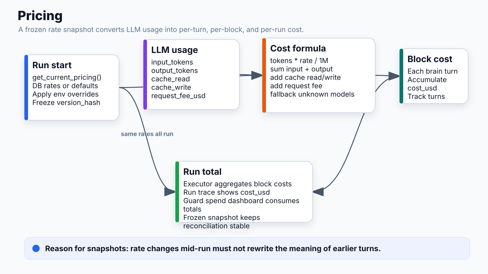

# Pricing



## What it does
Calculates cost per LLM call using per-provider/model token rates. Snapshot frozen at run start for consistency. Tracks cost per block; aggregates to run total.

## Location
`apps/api/app/runtime/pricing.py`

## Rate Card

All rates in USD per 1M tokens:

| Provider | Model | Input | Output | Cache Read | Cache Write | Request Fee |
|---|---|---|---|---|---|---|
| anthropic | claude-opus-4-7 | $15.00 | $75.00 | $1.50 | $18.75 | — |
| anthropic | claude-sonnet-4-6 | $3.00 | $15.00 | $0.30 | $3.75 | — |
| anthropic | claude-haiku-4-5-20251001 | $1.00 | $5.00 | $0.10 | $1.25 | — |
| openai | gpt-4o | $2.50 | $10.00 | — | — | — |
| openai | gpt-4o-mini | $0.15 | $0.60 | — | — | — |
| openai | gpt-4.1 | $2.00 | $8.00 | — | — | — |
| openai | gpt-5 | $3.00 | $15.00 | — | — | — |
| perplexity | sonar | $1.00 | $5.00 | — | — | $0.005 |

## Cost Formula

```python
cost = (
    input_tokens  * rates["input"]       / 1_000_000
  + output_tokens * rates["output"]      / 1_000_000
  + cache_read    * rates["cache_read"]  / 1_000_000
  + cache_write   * rates["cache_write"] / 1_000_000
  + rates["request_fee_usd"]             # flat per call (Perplexity)
)
```

## Snapshot Pattern

```python
# execute_run() — frozen once at run start
pricing_snapshot = get_current_pricing()   # reads DB or defaults

# all blocks use same snapshot for the run
cost = compute_cost(model, tokens, pricing_snapshot)
```

Why frozen: prevents mid-run rate changes from producing inconsistent per-block costs.

## Override Mechanism

```
PRICING_OVERRIDES_JSON env var:
{
  "anthropic": {
    "claude-sonnet-4-6": {"input": 2.50}
  }
}
```

Merges on top of defaults. Missing keys fall back to the default rate card.

A `version_hash` of the active rates is stored on each run for billing reconciliation.

## Fallbacks

- Anthropic model not found → `claude-sonnet-4-6` rates
- OpenAI model not found → `gpt-4o-mini` rates
- Cache tokens absent (OpenAI, Perplexity) → 0.0

## Connects to
- **Brain block**: receives `LLMUsage(input, output, cache_read, cache_write)` per turn, accumulates `cost_usd`
- **Executor**: freezes snapshot at `execute_run()` start; aggregates per-block cost to run total
- **Guard spend**: run total feeds the Guard spend dashboard (per-user, per-workspace budgets)
- **Run output**: `cost_usd` surfaced in run trace UI and analytics
