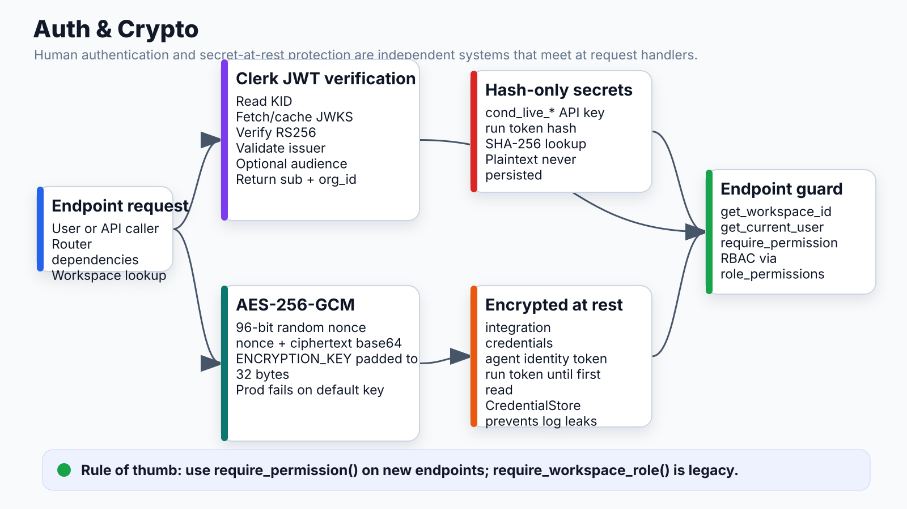

# Auth & Crypto



## What it does
Two independent systems: Clerk JWT verification for human users; AES-256-GCM encryption for credentials and tokens at rest. Neither depends on the other.

## Locations
- `apps/api/app/core/auth.py` — all request authentication
- `apps/api/app/core/crypto.py` — encrypt/decrypt

## Clerk JWT Verification

```
Authorization: Bearer <clerk_jwt>
  │
  1. Extract KID from unverified header
  2. Fetch JWKS from https://{CLERK_DOMAIN}/.well-known/jwks.json
     └─ Cached in-process; force-refreshed once if KID not found (key rotation)
  3. Verify RS256 signature using matching public key
  4. Validate issuer: https://{CLERK_FRONTEND_API}
  5. Validate audience: CLERK_AUDIENCE env var (optional)
  6. Return claims: {sub: user_id, org_id: workspace_id}
```

Security warning at startup if `CLERK_AUDIENCE` or `CLERK_FRONTEND_API` not set (verification weakened).

## AES-256-GCM Encryption

```python
# crypto.py

def encrypt(data: dict) -> str:
    nonce = os.urandom(12)                     # 96-bit random nonce
    ct = AESGCM(_key()).encrypt(nonce, json.dumps(data).encode(), None)
    return base64.b64encode(nonce + ct).decode()   # nonce prepended to ciphertext

def decrypt(blob: str) -> dict:
    raw = base64.b64decode(blob)
    nonce, ct = raw[:12], raw[12:]
    plaintext = AESGCM(_key()).decrypt(nonce, ct, None)
    return json.loads(plaintext)

def _key() -> bytes:
    raw = settings.ENCRYPTION_KEY.encode()
    return (raw + b'\x00' * 32)[:32]          # pad/truncate to 32 bytes
```

Fails fast in production if `ENCRYPTION_KEY` is the default dev value.

## What Gets Encrypted

| What | Column | Table |
|---|---|---|
| Integration credentials (GitHub token, Slack token, etc.) | `encrypted_credentials` | `integrations` |
| Agent identity token | `token_encrypted` | `agent_identities` |
| Run token | `token_encrypted` | `agent_run_tokens` (cleared after first use) |

## What Gets Hashed (not encrypted)

| What | Column | Why hash |
|---|---|---|
| User API key (cond_live_*) | `key_hash` (SHA-256) | Never need to recover plaintext; just verify |
| Run token | `token_hash` (SHA-256) | Fast prefix lookup without decrypting |

## CredentialStore — Log Safety

Credentials passed through execution wrapped in `CredentialStore` to prevent accidental `repr()` or `str()` leaks in logs or error traces.

## Auth Dependency Stack

```python
# Standard endpoint
@router.get("/workflows")
async def list_workflows(
    workspace_id: str = Depends(get_workspace_id),
    user_id: str = Depends(get_current_user),
    _: str = Depends(require_permission("platform.workflows.view")),
):

# Guard endpoint (supports cond_live_* API keys)
@router.post("/guard/proxy-config")
async def save_proxy_config(
    org_id: str = Depends(get_guard_org_id),
):
```

`require_permission()` queries `roles → role_permissions → permissions` (RBAC in DB). Never use `require_workspace_role()` for new endpoints — it's legacy.

## Dev Mode

If `CLERK_DISABLED=true`:
- `get_current_user()` returns a fixed dev user ID
- `get_workspace_id()` returns `settings.dev_workspace_id`
- First user to hit workspace gets admin auto-granted

## Connects to
- **Agent identity**: all tokens encrypted at rest via crypto.py
- **Executor**: decrypts Integration credentials at dispatch time (never in state)
- **Guard proxy**: resolves API keys via auth chain on every LLM call
- **All routers**: require_permission() + get_current_user() on every endpoint
