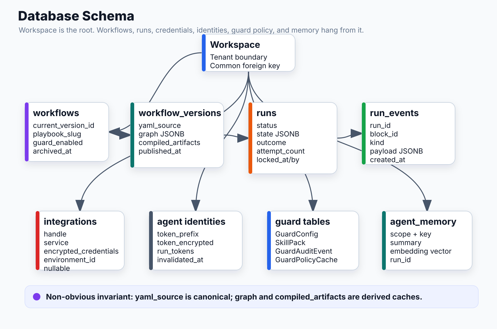

# Database Schema



## Key Tables & Relationships

```
Workspace
  ├─ Workflows[*]
  │   ├─ current_version_id → WorkflowVersion (FK)
  │   └─ versions → WorkflowVersion[*]
  │       ├─ yaml_source (TEXT)        ← canonical source of truth
  │       ├─ graph (JSONB)             ← {nodes, edges}, derived from yaml_source
  │       ├─ compiled_artifacts (JSONB)← {block_id: {system_prompt, tool_schema}}
  │       └─ runs → Run[*]
  │           ├─ state (JSONB)         ← accumulator: {block_id: output}
  │           ├─ outcome (JSONB)       ← {type, artifact_url}
  │           └─ events → RunEvent[*]
  ├─ Integrations[*]
  │   └─ encrypted_credentials (TEXT)  ← AES-256-GCM
  ├─ AgentIdentities[*]
  │   ├─ token_encrypted (TEXT)
  │   └─ run_tokens → AgentRunToken[*]
  │       └─ token_encrypted (nullable ← cleared after use)
  └─ Guard: GuardConfig, SkillPack, GuardAuditEvent, GuardPolicyCache
```

## Core Tables

### workflows
| Column | Type | Notes |
|---|---|---|
| id | UUID PK | |
| workspace_id | UUID FK | |
| name | String | |
| current_version_id | UUID FK | → workflow_versions |
| playbook_slug | String | "autopilot", "ai_risk_assessment", etc. |
| guard_enabled | Boolean | default true |
| agent_identity_required | Boolean | |
| archived_at | DateTime | soft delete |

### workflow_versions
| Column | Type | Notes |
|---|---|---|
| id | UUID PK | |
| workflow_id | UUID FK | |
| yaml_source | Text | canonical playbook YAML |
| graph | JSONB | `{nodes: [...], edges: [...]}` |
| compiled_artifacts | JSONB | `{block_id: {system_prompt, tool_schema}}` |
| published_at | DateTime | null = draft |

### runs
| Column | Type | Notes |
|---|---|---|
| id | UUID PK | |
| workflow_version_id | UUID FK | |
| workspace_id | UUID FK | |
| status | String | pending/running/paused/succeeded/failed/cancelled |
| state | JSONB | accumulated block outputs |
| outcome | JSONB | `{type, artifact_url}` |
| actual_turns | Integer | set at completion |
| budget_exhausted | Boolean | true if stopped by max_turns |
| attempt_count | Integer | retry counter |
| locked_at | DateTime | distributed executor lease |
| locked_by | String | executor process ID |
| last_heartbeat_time | DateTime | crash detection |

### run_events
| Column | Type | Notes |
|---|---|---|
| id | UUID PK | |
| run_id | UUID FK | |
| block_id | String | null for run-level events |
| kind | String | block_started / block_completed / block_failed |
| payload | JSONB | event-specific data |
| created_at | DateTime | |

### integrations
| Column | Type | Notes |
|---|---|---|
| workspace_id | UUID FK | |
| handle | String | "github", "slack", "env_vars", "proxy_config" |
| service | String | provider |
| encrypted_credentials | Text | AES-256-GCM |
| environment_id | UUID FK | null = workspace-level |

### agent_identities
| Column | Type | Notes |
|---|---|---|
| id | String PK | |
| workspace_id | UUID FK | |
| token_prefix | String | "cond_agt_" + 8 hex (indexed) |
| token_encrypted | Text | AES-256-GCM |
| environment_id | UUID FK | nullable |
| last_used_at | DateTime | |

### agent_run_tokens
| Column | Type | Notes |
|---|---|---|
| id | String PK | |
| run_id | String FK | |
| token_hash | String | SHA-256 (fast lookup) |
| token_prefix | String | "cond_run_" + prefix |
| token_encrypted | Text | nullable — cleared after first use |
| invalidated_at | DateTime | set on run completion |

### guard_audit_events
| Column | Type | Notes |
|---|---|---|
| workspace_id | UUID FK | |
| clerk_user_id | String | |
| ai_tool | String | "claude-code", "cursor", etc. |
| source | String | "proxy" (Guard proxy calls only) |
| provider | String | anthropic / openai |
| model | String | |
| decision | String | ALLOW / BLOCK / WARN |
| rule_id | String | which rule matched |
| tokens_before / tokens_after | Integer | for blocked calls |
| cost_usd_after | Float | |
| conductai_run_id | UUID | links to run (if via agent) |
| ts | DateTime | |

### guard_policy_cache
| Column | Type | Notes |
|---|---|---|
| workspace_id | UUID PK | |
| persona | String PK | "proxy" or "agent" |
| payload | JSONB | flattened rule list |
| version_hash | String | invalidated on any policy change |
| computed_at | DateTime | |

### agent_memory
| Column | Type | Notes |
|---|---|---|
| workspace_id | UUID | |
| scope | Text | "repo" or "workspace" |
| key | Text | e.g. "owner/repo-name" |
| summary | Text | lesson from the run |
| embedding | vector(1536) | pgvector, OpenAI text-embedding-3-small |
| run_id | UUID | which run wrote this |
| created_at | Timestamp | |

## Non-obvious Design Decisions

- `yaml_source` is canonical; `graph` and `compiled_artifacts` are derived and can be rebuilt
- `state` JSONB accumulates every block's output — survives Redis checkpoint failures
- Run leasing (`locked_at`, `locked_by`) allows multiple worker processes without double-execution
- `token_encrypted` on `agent_run_tokens` is cleared to NULL after executor reads it (log safety)
- `guard_policy_cache` composite PK (workspace + persona) — one cache row per policy surface
- `integration.environment_id = NULL` means workspace-level (applies to all environments); non-null means environment-specific
- `proxy_config` integration handle is always workspace-level (environment_id = NULL); pushed to env_vars via separate endpoint

## Connects to
- **Executor**: reads `workflow_versions.graph` + `compiled_artifacts`; writes `runs.state` + `run_events`
- **Policy engine**: reads/writes `guard_policy_cache`; reads `skill_packs` + `workspace_custom_rules`
- **Memory block**: reads/writes `agent_memory` with pgvector similarity search
- **Auth**: reads `agent_identities`, `agent_run_tokens`, `conduct_api_keys`
