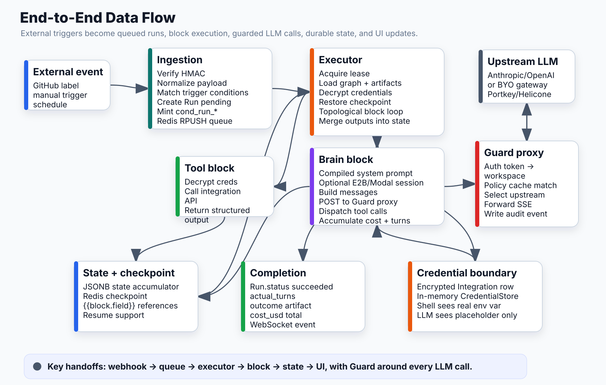

# End-to-End Data Flow



## Trigger → Response

```
External event (GitHub label, manual trigger, schedule)
  │
  ▼
┌─────────────────────────────────────────────────────┐
│ INGESTION                                           │
│ POST /webhooks/github                               │
│  1. Verify HMAC signature                           │
│  2. Normalize payload → internal schema             │
│  3. Match trigger conditions (label, repo allowlist)│
│  4. Create Run row (status=pending)                 │
│  5. Mint cond_run_* token                           │
│  6. r.rpush("marshal:runs:queue", run_id)           │
└────────────────────────┬────────────────────────────┘
                         │
                         ▼
┌─────────────────────────────────────────────────────┐
│ EXECUTOR  (execute_run)                             │
│  1. Acquire run lease (locked_at, locked_by)        │
│  2. Load WorkflowVersion (graph + compiled_artifacts│
│  3. Decrypt Integration credentials                 │
│  4. Freeze pricing snapshot                         │
│  5. Restore Redis checkpoint (resume support)       │
│  6. Topological sort blocks                         │
│                                                     │
│  FOR EACH BLOCK:                                    │
│   ├─ Resolve {{references}} from state              │
│   ├─ Emit block_started RunEvent                    │
│   ├─ Dispatch → block executor                      │
│   ├─ Merge output into state[block_id]              │
│   └─ Emit block_completed / block_failed            │
│                                                     │
│  On failure: run cleanup blocks (guaranteed)        │
└────────────────────────┬────────────────────────────┘
                         │
           ┌─────────────┴──────────────┐
           │                            │
           ▼                            ▼
    TOOL BLOCK                    BRAIN BLOCK
    (github, slack, etc.)         _execute_brain()
    Decrypt creds                  │
    Call integration API           ├─ Load compiled system_prompt
    Return structured output       ├─ Create E2B/Modal session
                                   │   (if runs_on set)
                                   │
                                   └─ AGENTIC LOOP:
                                       ├─ Build messages (system + context)
                                       ├─ POST to Guard proxy
                                       │   (never directly to vendor)
                                       ├─ Parse response
                                       ├─ Dispatch tool calls → session
                                       ├─ Accumulate cost + turns
                                       └─ Repeat until done
                         │
                         ▼
┌─────────────────────────────────────────────────────┐
│ GUARD PROXY  (every LLM call)                       │
│  POST /proxy/anthropic/v1/messages                  │
│   1. AUTH: resolve cond_run_* or guard-mt-* token   │
│      → workspace_id                                 │
│   2. POLICY: compute_policy(workspace_id, "proxy")  │
│      → cached in GuardPolicyCache                   │
│      → match provider + model + prompt (regex)      │
│      → BLOCK (403) | WARN (forward) | ALLOW (forward│
│   3. UPSTREAM: read PROXY_CONFIG_LLM_UPSTREAM        │
│      from env_vars for environment_id               │
│   4. KEY: PROXY_CONFIG_LLM_UPSTREAM_API_KEY          │
│      or vendor API key from integrations            │
│   5. FORWARD → StreamingResponse (SSE passthrough)  │
│   6. AUDIT (background): write guard_audit_events   │
└────────────────────────┬────────────────────────────┘
                         │
                         ▼
             Upstream LLM (Anthropic / OpenAI)
             OR BYO gateway (Portkey / Helicone)
                         │
                         ▼
┌─────────────────────────────────────────────────────┐
│ COMPLETION                                          │
│  Run.status = "succeeded"                           │
│  Run.actual_turns = N                               │
│  Run.outcome = {type, artifact_url}                 │
│  cost_usd aggregated from all block turns           │
│  WebSocket event published to UI                    │
│  Optional: output block → Slack/email notification  │
└─────────────────────────────────────────────────────┘
```

## State Accumulation Example

```python
# After webhook trigger
state = {
    "__triggered_by": "webhook:github_issue_labeled",
    "__max_turns": 50,
    "github_issue": {"number": 42, "title": "Fix auth bug", "body": "..."},
}

# After recall_context (memory block)
state["recall_context"] = {
    "entries": [{"summary": "Lesson: test runner is pytest", "at": "..."}],
    "count": 2,
}

# After plan_fix (brain, single-turn)
state["plan_fix"] = {
    "complexity": "medium",
    "approach": "Fix the JWT validation in auth.py",
}

# After implement_fix (brain, agentic, E2B)
state["implement_fix"] = {
    "output": "Fixed auth.py, tests pass. PR opened.",
    "pr_url": "https://github.com/owner/repo/pull/99",
    "turns": 23,
    "cost_usd": 0.041,
}

# output block references: {{implement_fix.pr_url}}
```

## Key Handoff Points

| Boundary | Mechanism | What crosses |
|---|---|---|
| Webhook → Queue | Redis RPUSH | run_id |
| Queue → Executor | Redis BLPOP | run_id → load Run from DB |
| Executor → Brain | Function call | state dict + credentials (decrypted) |
| Brain → Guard proxy | HTTP POST | LLM request + cond_run_* header |
| Guard → Upstream | HTTP forwarding | Full LLM request (vendor format) |
| Brain → E2B session | SDK call | tool name + args |
| Block → State | JSONB merge | block output dict |
| State → Redis | Checkpoint | full state dict (resume support) |
| Run → UI | SSE events | RunEvent stream |

## Credential Flow (never in state)

```
Integration.encrypted_credentials
  ↓ (decrypt at executor start)
credentials dict (in-memory only)
  ↓ (passed to brain block)
CredentialStore (prevents repr/log leaks)
  ↓ (swapped into env vars at dispatch time)
E2B session: GIT_TOKEN=ghp_abc123
LLM prompt: sees only __CREDENTIAL_GIT_TOKEN__
```

## Connects to
- All other mental models — this is the integration view
- See `01-execution-engine.md` for DAG traversal detail
- See `02-brain-block.md` for agentic loop detail
- See `03-guard-proxy.md` for proxy decision chain detail
- See `05-memory.md` for recall/record flow detail
